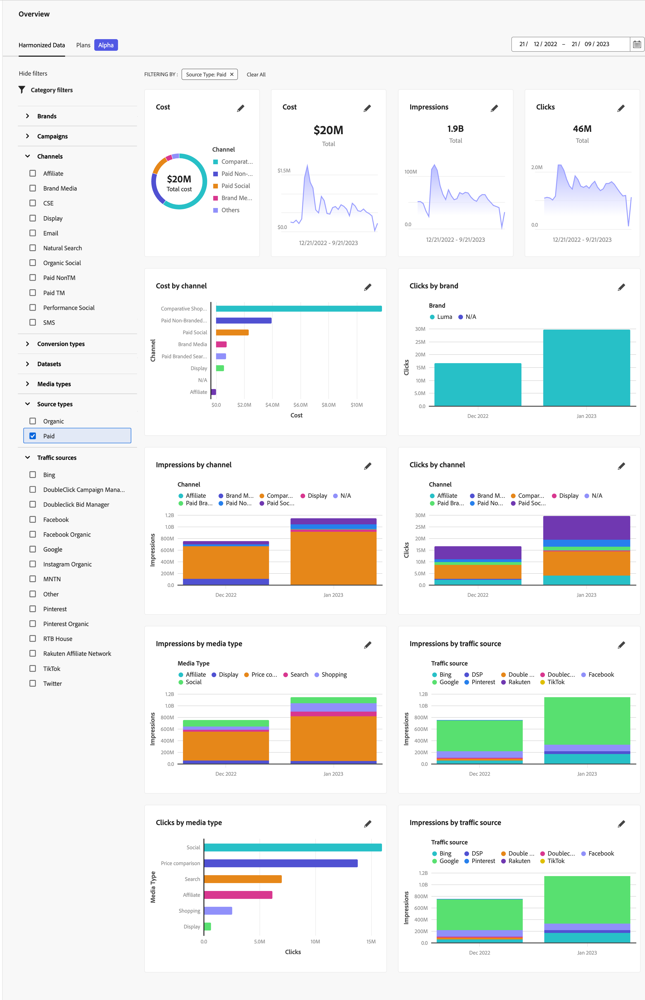

# Überblick über harmonisierte Daten

Die Registerkarte &quot;Harmonisierte Daten&quot;in der Übersicht über Adobe Mix-Modellierer bietet Einblicke in die harmonisierten Daten, die Sie für die Verwendung als Teil der erfassten Daten und der harmonisierten Dateneinrichtung konfiguriert haben.

Die Übersicht zeigt vier KPI-Statuskarten-Widgets (oberste Zeile) und sechs weitere konfigurierbare Widgets.

Um den Datumsbereich für die Anzeige von Daten in Widgets zu ändern, geben Sie ein Start- und ein Enddatum manuell ein oder wählen Sie einen Zeitraum mithilfe von .

## Datenfilter

Sie können die für alle Widgets angezeigten Daten filtern, indem Sie die  **[!UICONTROL Data Filters]** -Bereich.

Wählen Sie für jede Kategorie einen oder mehrere Filter aus (**[!UICONTROL Channel]**, **[!UICONTROL Brand]**, **[!UICONTROL Source Type]**, und **[!UICONTROL Traffic Source]**).

Die ausgewählten Filter werden über den Widgets unter **[!UICONTROL FILTERING BY:]**.

1. Um einen einzelnen Filter zu entfernen, wählen Sie  im Filter, aufgeführt unter **[!UICONTROL FILTERING BY:]**.

1. Sie können alle Filter schnell löschen mithilfe von **[!UICONTROL Clear All]**.

## Widget konfigurieren

Sie können jedes Widget konfigurieren.

* Im Widget zur KPI-Statuskarte:

   1. Auswählen  und  **[!UICONTROL Edit Data]** aus dem Kontextmenü aus.

   1. Im **[!UICONTROL KPI status card]** dialog:

      1. Wählen Sie eine **[!UICONTROL KPI]** aus der Liste.

      1. Auswählen **[!UICONTROL Apply]** , um die Änderung auf die Karte anzuwenden. Auswählen **[!UICONTROL Cancel]** , um die Änderung abzubrechen.

* Auf den anderen konfigurierbaren Widgets:

   1. Auswählen  und  **[!UICONTROL Edit Data]** aus dem Kontextmenü aus.

   1. Im **[!UICONTROL Edit Data]** dialog:

      1. Wählen Sie eine Metrik aus **[!UICONTROL Select a metric]**, beispielsweise **[!UICONTROL Impressions]**.
      1. Wählen Sie eine Kategorie aus **[!UICONTROL Select category]**, beispielsweise **[!UICONTROL Media Type]**.
      1. (optional) Wählen Sie eine zweite Kategorie aus **[!UICONTROL Select second category (optional)]**, beispielsweise **[!UICONTROL Traffic Source]**.
      1. Auswählen  **[!UICONTROL Time]** oder  **[!UICONTROL Total]** als Analysetyp unter **[!UICONTROL Select analysis type]**.

         Wenn Sie  **[!UICONTROL Time]**, können Sie die Zeitfrequenz festlegen. Auswählen **[!UICONTROL Daily]**, **[!UICONTROL Weekly]**, **[!UICONTROL Monthly]** oder **[!UICONTROL Quarterly]** von **[!UICONTROL Select time frequency]**.

         Sie sehen eine aktualisierte Vorschau Ihrer aktuellen Auswahl in der [!UICONTROL Preview Area] und Ihr aktuelles Widget darunter [!UICONTROL Current].

         

         Wenn die Vorschau nicht gerendert werden kann, weil keine Daten verfügbar sind, wird  [!UICONTROL Insights Not Available] - [!UICONTROL Harmonized fields are not available].

      1. Auswählen **[!UICONTROL Apply]** , um die Änderungen auf das Widget anzuwenden. Auswählen **[!UICONTROL Cancel]** , um alle Änderungen am aktuellen Widget abzubrechen.

