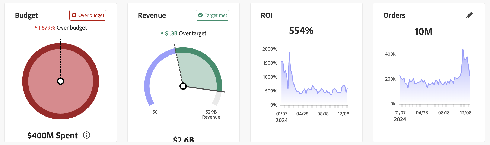
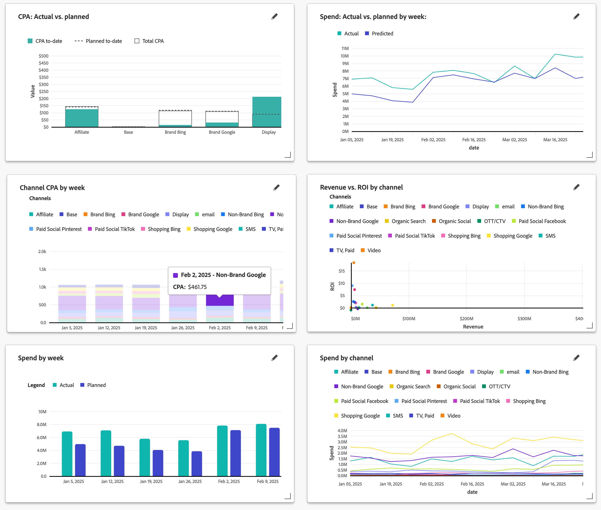

# Zu planende Leistung

>[!NOTE]
>
>Die Registerkarte **[!UICONTROL Performance to plan]** [!BADGE Beta]{type=Informative} in Mix Modeler  **[!UICONTROL Overview]** ist eine Beta-Funktion und ihre Funktionalität kann sich ändern. Die Funktion steht einer begrenzten Anzahl von Kunden zur Verfügung.

Die Registerkarte **[!UICONTROL Plans]** [!BADGE Beta]{type=Informative} in Mix Modeler  **[!UICONTROL Overview]** bietet ein Tracking-Dashboard, mit dem überwacht werden kann, wie gut Ihr Marketing im Vergleich zum Plan abschneidet. Sie können die tatsächliche Leistung im Vergleich zur geplanten Leistung anhand von Statuskarten und Visualisierungen verfolgen.

Das Dashboard hilft Ihnen, Lücken zu identifizieren, Risiken oder Chancen zu erkennen und rechtzeitig Anpassungen an Ihren Plänen und Budgets vorzunehmen.

So wählen Sie aus, welche Daten für die KPI-Statuskarten und Visualisierungen angezeigt werden:

* Wählen Sie im Dropdown-Menü **[!UICONTROL Plan name]** einen Plan aus und verwenden Sie **[!UICONTROL _Option auswählen…_]**.

* Geben Sie einen Datumsbereich an. Um den Datumsbereich zu ändern, geben Sie das Start- und Enddatum manuell ein oder wählen Sie mithilfe von  aus.

Die Registerkarte **[!UICONTROL Plans]** [!BADGE Beta]{type=Informative} zeigt:

* [KPI-](#kpi-status-cards):

   * [Budget](#budget)
   * [Umsatz](#revenue)
   * [ROI](#roi)
   * [KPI](#kpi)

* [Visualisierungen](#visualizations):
   * [*Metrik*: Tatsächlich vs. geplant](#metric-actual-vs-planned)
   * [*Metrik*: Tatsächliche vs. geplante nach *Granularität*](#metric-actual-vs-planned-by-granularity)
   * [Kanal *Metrik* nach *Granularität*](#channel-metric-by-granularity)
   * [*Metrik* vs *Metrik* nach Kanal](#metric-vs-metric-by-channel)
   * [*Metrik* nach *Granularität*](#metric-by-granularity)
   * [*Metrik* nach Kanal](#metric-by-channel)

## KPI-Statuskarten

### Budget

Eine zirkuläre Fortschrittsvisualisierung, die anzeigt, wie sich Ihre Marketing-Ausgaben im Vergleich zum Budget Ihres Plans für den Datumszeitraum verhalten.

### Umsatz

Eine zirkuläre Fortschrittsvisualisierung, die anzeigt, wie der tatsächliche Umsatz im Vergleich zu Ihrem geplanten Zielumsatz für den Datumszeitraum steht.

### ROI

Eine Linienvisualisierung, die den ROI für den Datumszeitraum anzeigt.

### KPI

Eine Linienvisualisierung, die den KPI für den Datumsbereich anzeigt.

Einen anderen KPI auswählen:

1. Wählen Sie  aus.
1. Wählen Sie im **[!UICONTROL KPI status card]**-Dialogfeld einen KPI aus dem Dropdown-Menü **[!UICONTROL KPI]** aus. Verfügbare Optionen sind: [!UICONTROL Conversions], [!UICONTROL CPA], [!UICONTROL Revenue], [!UICONTROL ROI] und [!UICONTROL Spend].

## Visualisierungen

Sechs Visualisierungen sind verfügbar, und Sie können jede der sechs Visualisierungen bearbeiten.

Um die Größe einer Visualisierung zu ändern, verwenden Sie den ┛ Ziehgriff unten rechts. Um eine Visualisierung zu verschieben, ziehen Sie sie einfach per Drag-and-Drop an die gewünschte Position.

Sie können den Mauszeiger über eine beliebige Linie, einen Balken oder ein Streuelement in einer Visualisierung bewegen, um ein Popup mit zusätzlichen Informationen anzuzeigen.

### *Metrik*: Tatsächlich vs. geplant

Eine gestapelte Balkenvisualisierung, die die ausgewählten Metrikwerte für „Aktuell“, „Geplant bis heute“ und „Gesamtwerte“ vergleicht.

### *Metrik*: Tatsächliche vs. geplante nach *Granularität*

Eine Linienvisualisierung, die die tatsächlichen und geplanten Werte für die ausgewählte Metrik und die ausgewählte Granularität anzeigt.

### Kanal *Metrik* nach *Granularität*

Eine Visualisierung gestapelter Balken , die gestapelte Balken anzeigt, welche Kanäle für die ausgewählte Metrik und die ausgewählte Granularität anzeigen.

### *Metrik* vs *Metrik* nach Kanal

Eine Streuvisualisierung, die ein Streudiagramm für Kanäle über die ausgewählten Metriken hinweg anzeigt.

### *Metrik* nach *Granularität*

Eine Balkenvisualisierung, die die tatsächlichen und geplanten Werte für die ausgewählte Metrik anzeigt.

### *Metrik* nach Kanal

Eine mehrzeilige Visualisierung, die die ausgewählte Metrik über die ausgewählte Granularität hinweg anzeigt.

### Bearbeiten einer Visualisierung

Bearbeiten einer Visualisierung:

1. Wählen Sie  aus, um das Dialogfeld &quot;**[!UICONTROL Edit data]**&quot; zu öffnen.
1. Je nach Visualisierung können Sie Folgendes ändern:

   * Eine oder zwei Metriken: Wählen Sie eine Metrik aus dem Dropdown-Menü **[!UICONTROL Select metric]** aus.

      * Bei ROI-basierten Plänen sind die Optionen: [!UICONTROL Conversions], [!UICONTROL CPA], [!UICONTROL Revenue], [!UICONTROL ROI], [!UICONTROL Spend] und [!UICONTROL Volume].
      * Für CPA-basierte Pläne sind die Optionen: [!UICONTROL Conversions], [!UICONTROL CPA], [!UICONTROL Spend] und [!UICONTROL Volume].
   * **[!UICONTROL Granularity]**: Wählen Sie entweder **[!UICONTROL date ranges]** oder **[!UICONTROL week]** aus dem **[!UICONTROL Granularity]** Dropdown-Menü aus.

   In **[!UICONTROL Preview]** sehen Sie, wie sich die Änderungen von der **[!UICONTROL Current]** Visualisierung unterscheiden.

1. Wählen Sie **[!UICONTROL Apply]** aus, um die Änderungen anzuwenden. Wählen Sie **[!UICONTROL Cancel]** aus, um alle Änderungen an der Visualisierung rückgängig zu machen.
