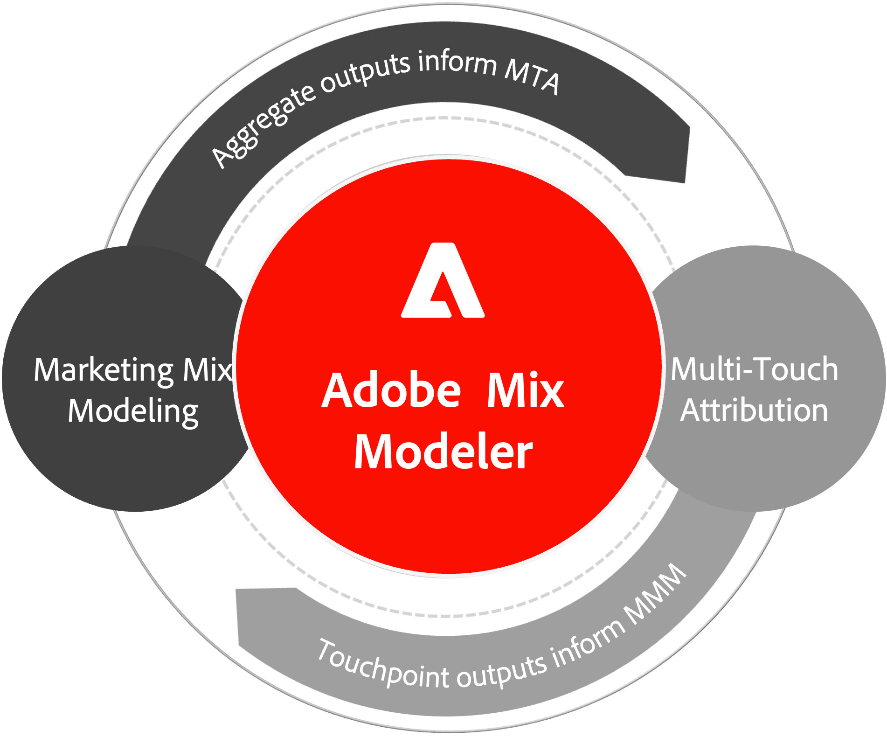

# Übersicht über Mix Modeler

In diesem Video erhalten Sie einen schnellen Überblick über die Funktionen von Mix Modeler.

>[!VIDEO](https://video.tv.adobe.com/v/3424872/?learn=on)

Mix Modeler basiert auf Adobe Sensei und ermöglicht es Marketing-Experten, Kampagnen zu messen und die Planung auf allen Kanälen ganzheitlich zu optimieren: bezahlt, verdient und eigenverantwortlich. Die einheitliche Methodik misst schrittweise sowohl auf Marketing- als auch auf aggregierter Ebene und gewährleistet gleichzeitig vollständig konsistente Ergebnisse.

Mix Modeler bietet die inkrementelle Auswirkung aller Marketing-Aktivitäten auf Geschäfts- und Kampagnenergebnisse durch eine ganzheitliche (End-to-End) Messungsanwendung für digitales und Offline-Marketing.

Mix Modeler bietet die folgenden Arten von optimierten und umsetzbaren Einblicken auf strategischer und taktischer Ebene, sodass Sie Folgendes besser verstehen können:

* Marketing-Ausgaben und daraus resultierende Leistung über verschiedene Kanäle hinweg und
* empfohlene Investitionsniveaus zur Erreichung künftiger Geschäftsziele.

Um diese Funktion zu nutzen, kombiniert Mix Modeler Folgendes:

* Daten auf der unteren Ebene (Ereignisebene) und Daten von oben nach unten (auf aggregierter Ebene),
* externe Marktfaktoren und interne Faktoren und
* Prognosemethoden und Transfer von maschinellem Lernen.

Das bidirektionale AI/ML-Übertragungs-Lernen vereinheitlicht die Ergebnisse der Marketing-Mix-Modellierung (MMM) und Multi-Touch-Attribution (MTA), um in einer Cookie-losen Welt konsistente Ergebnisse bei Messung und Planung sicherzustellen.

{width="500" align="center"}

## Funktionen

Mix Modeler bietet die folgenden Funktionen:

| Funktion | Beschreibung |
|---|---|
| **Inkrementelle Leistung messen** | Erfahren Sie mehr über den inkrementellen ROI und die Auswirkungen von Marketing auf Geschäftsziele oder taktische Kampagnenziele. |
| **Ergebnisse über MTA und MTA vereinheitlichen** | Mit der Vereinheitlichung von MMM- und MTA-Modellen über Transfer Learning können Sie selbstbewusstere Entscheidungen treffen. |
| **Optimale Zuordnung von Budgets** | Ermitteln Sie eine optimale Budgetzuweisung basierend auf den Marketing-Ausgaben und den Auswirkungen auf die Ziele. |
| **Erstellen und Vergleichen von Budgetszenarien** | Entwickeln Sie mehrere Budgetpläne und vergleichen Sie deren Auswirkungen, um optimale Entscheidungen für Ihr Unternehmen zu treffen. |

{style="table-layout:auto"}
