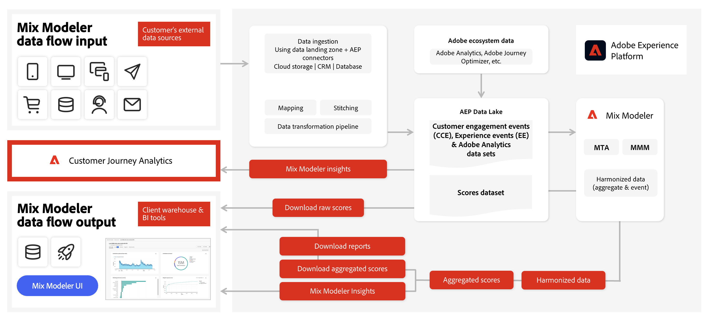

# Mix Modeler-Workflow

In diesem Video erhalten Sie eine Einführung in den Benutzer-Workflow in Mix Modeler.

>[!VIDEO](https://video.tv.adobe.com/v/3440213/?captions=ger&learn=on)

Ein typischer Workflow in Mix Modeler besteht aus den folgenden Aktivitäten:

|  | Aktivität | Beschreibung |
|---|---|---|
| {width="100"} | [**Daten aufnehmen**](../ingest-data/overview.md) | Ereignisdaten aus Experience Platform (z. B. Adobe Analytics, Web SDK, andere Quellen), aggregierte Daten aus Marketing-Kanälen (z. B. TV, ummauerte Gärten, E-Mail, eigene und betriebene Aktivitäten), Daten zu externen Faktoren von Kunden (z. B. Preisänderungen bei Abonnement-Services) und Daten zu internen Faktoren (z. B. Urlaubspläne) aufnehmen. |
| {width="100"} | [**Daten harmonisieren**](../harmonize-data/overview.md) | Konfigurieren Sie Zuordnungsregeln und Konfliktlösungsregeln, um die verschiedenen Marketing-Datensätze zusammenzuführen, die zur Messung und Planung der Kampagnenleistung in Mix Modeler erforderlich sind. |
| {width="100"} | [**Erstellen von Modellen**](../models/overview.md) | Erstellen Sie Modellinstanzen mit Marketing-Touchpoints (z. B. Kanälen), Konversionsdefinitionen und internen und externen Faktoren. |
| {width="100"} | [**Trainieren und Bewerten von Modellen**](../models/overview.md) | Erstellen Sie aggregierte Werte und Werte auf Ereignisebene mithilfe von Machine-Learning-Schulungen und -Bewertungen. |
| {width="100"} | [**Pläne erstellen**](../plans/overview.md) | Erstellen und Erstellen von Plänen Ermitteln Sie mithilfe der Ergebnisse der Mix Modeler-Modelle die optimale Zuordnung von Marketing-Mitteln, um ein Geschäftsziel zu erreichen. |
| {width="100"} | [**Übersichts-Dashboard**](../dashboard/overview.md) | Erhalten Sie mithilfe verschiedener konfigurierbarer Visualisierungen Einblicke in harmonisierte Daten, Modelle und Pläne. |

{style="table-layout:auto"}

Nachfolgend finden Sie einen Überblick darüber, wie Eingabedaten in Mix Modeler fließen können und wie Mix Modeler Ausgabedaten für die eigene Benutzeroberfläche, aber auch für andere Lösungen wie Customer Journey Analytics erzeugen kann.

<!--
The detailed data-oriented flowchart below illustrates how:

* harmonized data is based on:

  * experience event data (originating from Analytics source connector, collected through Experience Platform SDKs and APIs, ingested through source connectors, or using streaming ingestion),
  * aggregate or summary data from walled gardens (like Facebook, YouTube), traffic sources, or offline advertising data, and 
  * definitions of harmonized fields and dataset rules.

* a model is based on:

  * the conversion and marketing touchpoint definitions resulting from the harmonized data and 
  * non-marketing aggregate or summary data containing internal or external factors.

* mult-touch attribution event scores can potentially be fed back into Experience Platform data lake for use in subsequent model configuration, training and scoring.

-->
