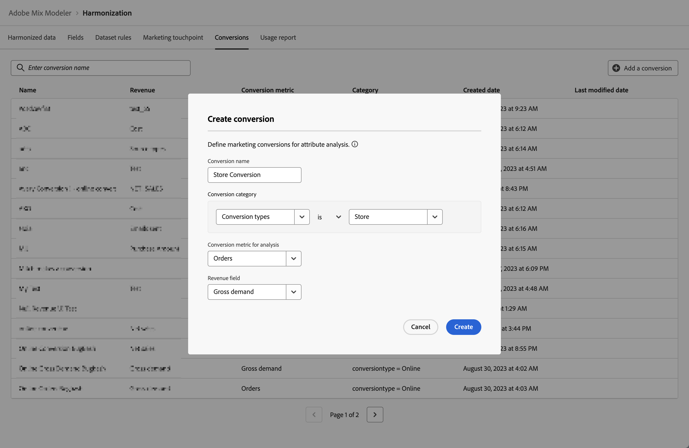

# Konversionen

Konversionsereignisse sind Geschäftsziele, die die Auswirkungen von Marketingaktivitäten identifizieren. Beispiele: E-Commerce-Bestellungen, In-Store-Käufe, Website-Besuche usw.

Sie definieren Marketing-Konversionen für die Attributionsanalyse.

## Konversionen verwalten

Um eine Tabelle der verfügbaren Konvertierungen anzuzeigen, gehen Sie in die Mix Modeler-Oberfläche:

1. Auswählen  **[!UICONTROL Harmonized data]** über die linke Leiste.

1. Auswählen **[!UICONTROL Conversions]** aus der oberen Leiste. Es wird eine Tabelle der Konversionen angezeigt.

Die Tabellenspalten geben Details zur Konvertierung an:

| Spaltenname | Details |
| --- | ---|
| Name | Der Name der Konvertierung. |
| Umsatz | Die harmonisierte Datenmetrik zur Berechnung des Umsatzes. |
| Konversionsmetrik | Die harmonisierte Datenmetrik, die als Konversionsmetrik für die Analyse verwendet werden soll. |
| Erstellt | Datum und Uhrzeit der Erstellung der Konvertierung. |
| Zuletzt geändert | Datum und Uhrzeit der letzten Änderung der Konversion. |

{style="table-layout:auto"}

## Konvertierung hinzufügen

Um eine Konversion hinzuzufügen, müssen Sie im  **[!UICONTROL Harmonized data]** > **[!UICONTROL Conversion]** -Schnittstelle in Mix Modeler:

1. Auswählen  **[!UICONTROL Add a conversion]**.

1. Im **[!UICONTROL Create Conversion]** dialog:

   1. Geben Sie einen Namen für **[!UICONTROL Conversion]**, beispielsweise `Store Conversions`.

   1. Definieren Sie die **[!UICONTROL Conversion category]**.

      1. Wählen Sie einen Wert aus **[!UICONTROL *Harmonisieren...*]**, beispielsweise `Conversion Type`.

      1. Wert für den Operator auswählen , beispielsweise **[!UICONTROL is]**.

      1. Wählen Sie einen Wert aus **[!UICONTROL *Wert auswählen *]**oder geben Sie einen Wert ein, beispielsweise **[!UICONTROL Store]**.

   1. Wählen Sie ein harmonisiertes Feld aus **[!UICONTROL Conversion metric for analysis]**, beispielsweise **[!UICONTROL Orders]**.

   1. Wählen Sie ein harmonisiertes Feld aus **[!UICONTROL Revenue field]**, beispielsweise **[!UICONTROL Gross Demand]**.

   1. Um die Konvertierung zu erstellen, wählen Sie **[!UICONTROL Create]**. Um die Erstellung einer Konvertierung abzubrechen, wählen Sie **[!UICONTROL Cancel]**.

      

1. Nach der Erstellung wird die Konversion der Konversionstabelle hinzugefügt.
