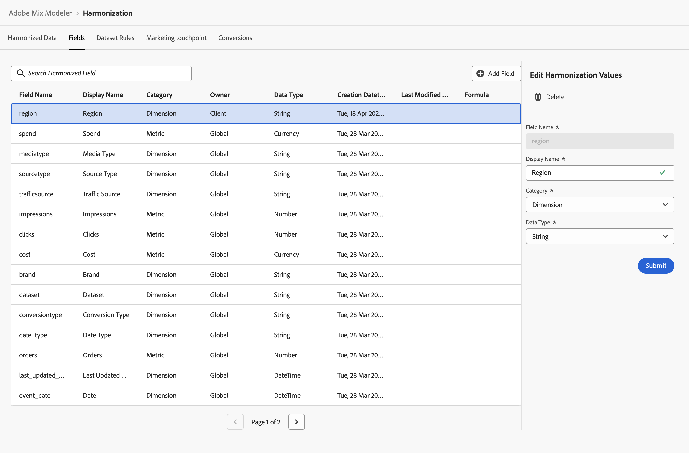

# Harmonisierte Felder

Harmonisierte Felder ermöglichen es Ihnen, Felder für konzeptionell dieselben Daten zu definieren, die aus verschiedenen Quellen stammen und jeweils eine eigene Definition dieser Daten enthalten. Beispielsweise kann eine Klickmetrik je nach Datenquelle anders definiert und benannt werden. Ein harmonisiertes Feld für Klicks ermöglicht es Ihnen, basierend auf diesen verschiedenen Klickdatenquellen eine gemeinsame Nomenklatur für eine Klickmetrik zu definieren.

Mithilfe von harmonisierten Feldern können Sie die Felder definieren, die Sie im Rahmen des Daten-Workflows harmonisieren möchten. Die von Ihnen definierten Felder können zum Definieren von Datensatzregeln, Marketing-Touchpoints und Konversionen verwendet werden.

## Globale Harmonisierungsbereiche

Die standardmäßig verfügbaren globalen Harmonisierungsfelder in Mix Modeler sind:

| Feldname | Anzeigename | Kategorie | Datentyp | Kommentar |
| ---------------------- | ---------------------- | --------- | --------- | --------- |
| Marke | Marke | Dimension | Zeichenfolge |           |
| Kampagne | Campaign | Dimension | Zeichenfolge |           |
| channel | Kanal | Dimension | Zeichenfolge |           |
| channel_id | Kanal-ID | Dimension | Zeichenfolge |           |
| channel_type_at_source | Kanaltyp bei Quelle | Dimension | Zeichenfolge |           |
| channel | Kanal | Dimension | Zeichenfolge |           |
| Klicks | Klicks | Metrik | Zahl |           |
| conversiontype | Konversionstyp | Dimension | Zeichenfolge |           |
| Kosten | Kosten | Metrik | Währung |           |
| Datensatz | Datensatz | Dimension | Zeichenfolge |           |
| date_type | Datum Typ | Dimension | Zeichenfolge | Tag, Woche |
| email | Gesendete E-Mails | Metrik | Zahl |           |
| event_date | Datum | Dimension | DateTime |           |
| brutto_demand | Bruttonachfrage | Metrik | Währung |           |
| Impressionen | Implikationen | Metrik | Zahl |           |
| last_updated_date | Letztes Aktualisierungsdatum | Dimension | DateTime |           |
| linkvisitors | Besuche verknüpfen | Metrik | Zahl |           |
| mediatype | Medientyp | Dimension | Zeichenfolge |           |
| net_sales | Nettoverkäufe | Metrik | Währung |           |
| Bestellungen | Bestellungen | Metrik | Zahl |           |
| sourcetype | Quelltyp | Dimension | Zeichenfolge |           |
| ausgaben | Ausgeben | Metrik | Währung |           |
| trafficSource | Traffic-Quelle | Dimension | Zeichenfolge |           |

{style="table-layout:auto"}

Sie können zusätzlich zu diesen global harmonisierten Feldern Ihre eigenen harmonisierten Felder hinzufügen, bearbeiten oder löschen.

## Harmonisierte Felder verwalten

Eine Tabelle der verfügbaren harmonisierten Felder finden Sie in der Mix Modeler-Benutzeroberfläche:

1. Auswählen  **[!UICONTROL Harmonized data]** über die linke Leiste.

1. Auswählen **[!UICONTROL Fields]** aus der oberen Leiste. Sie sehen eine Tabelle der harmonisierten Felder. Wenn weitere Seiten verfügbar sind, verwenden Sie  oder  at **[!UICONTROL Page _x _von_x_]** , um zwischen den Tabellenseiten zu wechseln.

   Die Tabellenspalten geben Details zu den harmonisierten Feldern an

   | Spaltenname | Details |
   | ---------------------- | ----------|
   | Feldname | Der Name des harmonisierten Felds. |
   | Anzeigename | Der Anzeigename des harmonisierten Felds. Dieser Anzeigename wird beim Definieren von Datensatzregeln, Marketing-Touchpoints und Konversionsdefinitionen verwendet. |
   | Kategorie | Gibt an, ob ein harmonisiertes Datenfeld ein [!UICONTROL Dimension], a [!UICONTROL Metric] oder [!UICONTROL Derived]. Eine abgeleitete Kategorie ist ein harmonisiertes Feld, das eine metrikbasierte Formeldefinition verwendet. |
   | Datentyp | Gibt den Datentyp ([!UICONTROL Number], [!UICONTROL String], [!UICONTROL Currency], [!UICONTROL DateTime]). |
   | Erstellungsdatum | Datum und Uhrzeit der Erstellung des harmonisierten Felds. |
   | Inhaber | Gibt an, ob ein harmonisiertes Feld ein Standardfeld ist ([!UICONTROL Global]) oder von Ihnen definiert wird ([!UICONTROL Client]). |
   | Datum der letzten Änderung | Daten und Zeitpunkt der letzten Änderung des harmonisierten Felds. |
   | Formel | Gibt die Formel für ein harmonisiertes Feld basierend auf einer abgeleiteten Kategorie an. |

   {style="table-layout:auto"}

1. Verwenden Sie zum Suchen nach einem bestimmten harmonisierten Feld  **[!UICONTROL *Harmonisiertes Suchfeld *]**.

### Harmonisiertes Feld hinzufügen

Um ein harmonisiertes Feld hinzuzufügen, müssen Sie im  **[!UICONTROL Harmonized data]** > **[!UICONTROL Fields]** -Schnittstelle im Mix Modeler:

1. Auswählen  **[!UICONTROL Add field]**.

1. Im **[!UICONTROL Create]** dialog:

   1. Geben Sie einen **[!UICONTROL Field name]**, beispielsweise `region`.
   1. Geben Sie einen **[!UICONTROL Display name]**, beispielsweise `Region`.
   1. Wählen Sie eine **[!UICONTROL Category]**: **[!UICONTROL Dimension]**, **[!UICONTROL Metric]** oder **[!UICONTROL Derived]**.

      Wenn Sie **[!UICONTROL Derived]**, geben Sie eine **[!UICONTROL Formula]**. Um einen gültigen arithmetischen Ausdruck zu erstellen, kombinieren Sie eine oder mehrere Metriken aus **[!UICONTROL Insert Metric]** mit einem oder mehreren Operatoren **[!UICONTROL + - * / ( )]** . Beispiel: `[orders]/[impressions]`

   1. Wählen Sie eine **[!UICONTROL Data type]**.

      - **[!UICONTROL String]** oder **[!UICONTROL DateTime]**, wenn die ausgewählte Kategorie Dimension ist.
      - **[!UICONTROL Number]** oder **[!UICONTROL Currency]** wenn die ausgewählte Kategorie Metrik oder Abgeleitet ist.

   1. Auswählen **[!UICONTROL Submit]** um das harmonisierte Feld hinzuzufügen. Auswählen **[!UICONTROL Close]** das Dialogfeld zu schließen, ohne das harmonisierte Feld hinzuzufügen.

      

### Harmonisiertes Feld bearbeiten

Sie können nur harmonisierte Felder bearbeiten, die Sie zuvor erstellt haben (Eigentümer ist Client). Ein global harmonisiertes Feld kann nicht bearbeitet werden.

So bearbeiten Sie ein harmonisiertes Feld im  **[!UICONTROL Harmonized data]** > **[!UICONTROL Fields]** -Schnittstelle im Mix Modeler:

1. Wählen Sie das harmonisierte Feld aus, das Sie bearbeiten möchten. Beispiel: **[!UICONTROL Region]**.

1. Im **[!UICONTROL Edit harmonization values]** -Bereich, Werte ändern für **[!UICONTROL Display name]**, **[!UICONTROL Category]**, und **[!UICONTROL Data type]**. Siehe [Harmonisiertes Feld hinzufügen](#add-a-harmonized-field) für weitere Informationen.

1. Auswählen **[!UICONTROL Submit]** die Änderungen auf den harmonisierten Bereich anzuwenden.

   

### Harmonisiertes Feld löschen

Sie können nur harmonisierte Felder löschen, die Sie zuvor erstellt haben (Eigentümer ist Kunde). Ein globales harmonisiertes Feld kann nicht gelöscht werden.

So löschen Sie ein harmonisiertes Feld im  **[!UICONTROL Harmonized data]** > **[!UICONTROL Fields]** -Schnittstelle im Mix Modeler:

1. Wählen Sie beispielsweise das harmonisierte Feld aus, das Sie löschen möchten **[!UICONTROL Region]**.

1. Auswählen  **[!UICONTROL Delete]** aus dem **[!UICONTROL Edit harmonization values]** linker Bereich.

   >[!WARNING]
   >
   >   Das Feld wird sofort gelöscht.

