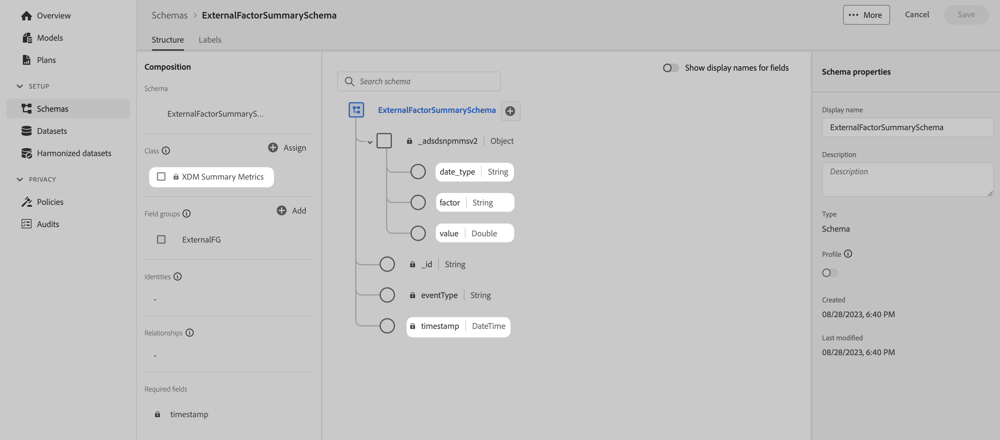

# Schemata

So verwalten Sie Schemata, indem Sie die Daten unterstützen, die Sie in Adobe Experience Platform erfassen und im Adobe Mix-Modeler verwenden möchten:

1. Wechseln Sie zur Adobe Mix Modeler-Oberfläche.

1. Auswählen  **[!UICONTROL Schemas]**, darunter **[!UICONTROL DATA MANAGEMENT]**.

Siehe [Übersicht über die Benutzeroberfläche von Schemas](https://experienceleague.adobe.com/docs/experience-platform/xdm/ui/overview.html?lang=de) für weitere Informationen.

## Aggregat- oder Zusammenfassungsdaten

Es wird dringend empfohlen, die Klasse &quot;XDM-Zusammenfassungsmetriken&quot;als Grundlage des Schemas zu verwenden, das allen Aggregat- oder Zusammenfassungsdaten zugrunde liegt, die Sie in Experience Platform erfassen und in Adobe Mix Modeler verwenden möchten.

Verwenden Sie die Klasse &quot;XDM-Zusammenfassungsmetriken&quot;für:

- Gartendaten, z. B. Daten aus Facebook oder YouTube, installiert.

- externe Faktoren, wie Daten aus SPX (S&amp;P 500 Börsenkursindizes), Wetterdaten,

- interne Faktoren, z. B. Preisänderungen, einen Weihnachtskalender.

>[!IMPORTANT]
>
>Die Schemadefinition muss mindestens ein numerisches Feld enthalten (unter Verwendung von Integer, Double, Boolean oder einem anderen numerischen Typ), um die erforderlichen Metriken für die erfassten Daten zu unterstützen.

Ein Schema, das **[!DNL XDM Summary Metrics]** Die Basisklasse kann einfach sein, wie in der **[!DNL ExternalFactorSummarySchema]** unten.

Dieses einfache Schema kann zum Erfassen von Datensätzen verwendet werden, die Daten für Folgendes enthalten:

- Konkurrierende Indexdaten

  | Zeitstempel | date_type | Faktor | value |
  |---|---|---|--:|
  | 28.11.2020:00:00.000Z | Woche | Konkurrentenindex | 289.8 |
  | 2020-12-05T00:00:00.000Z | Woche | Konkurrentenindex | 291.2 |
  | 12.12.2020 T00:00:00.000Z | Woche | Konkurrentenindex | 280.07 |
  | ... | ... | ... | ... |

- Daten zu Feiertagszeiten

  | Zeitstempel | date_type | Faktor | value |
  |---|---|---|--:|
  | 28.11.2020:00:00.000Z | Woche | all_days_flag | 0.0 |
  | 2020-12-05T00:00:00.000Z | Woche | all_days_flag | 0.0 |
  | 12.12.2020 T00:00:00.000Z | Woche | all_days_flag | 0.0 |
  | 2020-12-19T00:00:00.000Z | Woche | all_days_flag | 0.0 |
  | 26.12.2020:00:00.000Z | Woche | all_days_flag | 1,0 |
  | ... | ... | ... | ... |

Ein umfassenderes Beispiel für eine **[!DNL LumaPaidMarketingSchema]** mithilfe der **[!DNL XDM Summary Metrics]** als Basisklasse. Das Schema verwendet dedizierte Feldergruppen (mit Farben kommentiert) für Metriken (**[!DNL AMMMetrics]**), Dimensionen (**[!DNL AMMDimensions]**) und anderen kundenspezifischen Informationen (**[!DNL CustomerSpecific]**).

Angesichts der asynchronen Art der Profilerfassung wird bei der Erfassung von Aggregat- oder Zusammenfassungsdaten aus externen Quellen empfohlen, die Feldergruppe &quot;Prüfdetails des externen Quellsystems&quot;als Teil eines Schemas zu verwenden. Diese Feldergruppe definiert einen Satz von Prüfeigenschaften für externe Quellen.
