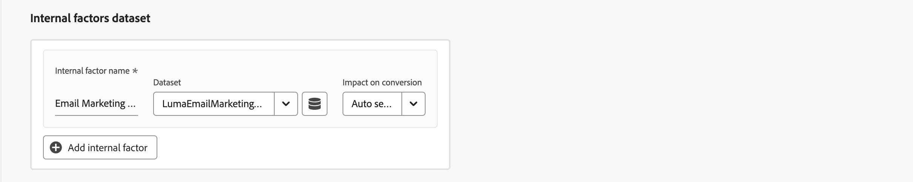

# Modell erstellen

So erstellen Sie ein Modell in der  **[!UICONTROL Models]** Benutzeroberfläche in Mix Modeler auswählen **[!UICONTROL Guide me]**.

Um Ihre benutzerdefinierten KI-gestützten Modelle zu erstellen, bietet die Benutzeroberfläche einen schrittweisen Konfigurationsfluss für Modelle.

1. Im **[!UICONTROL Setup]** step:

   1. Modell eingeben **[!UICONTROL Name]**, beispielsweise `Demo model`. Geben Sie einen **[!UICONTROL Description]**, beispielsweise `Demo model to explore AI featues of Mix Modeler`.

      

   1. Auswählen **[!UICONTROL Next]** , um mit dem nächsten Schritt fortzufahren. Auswählen **[!UICONTROL Cancel]** , um die Modellkonfiguration abzubrechen.

1. Im **[!UICONTROL Configure]** step:

   1. Im **[!UICONTROL Conversion goal]** -Abschnitt innerhalb des Containers:

      1. Geben Sie einen **[!UICONTROL Conversion name]** für die Konvertierung, beispielsweise `Conversion`

      1. Wählen Sie eine Konversion aus **[!UICONTROL *Harmonisiertes Feld auswählen *]**, die die verfügbaren Konversionen enthält, die Sie als Teil von [Konversionen](../harmonize-data/conversions.md) in [!UICONTROL Harmonized datasets]. Beispiel,**[!UICONTROL Online Conversion]**.

      1. Sie können  **[!UICONTROL Create new conversion]** , um eine Konversion direkt aus der Modellkonfiguration zu erstellen.

         

   1. Im **[!UICONTROL Marketing touchpoints]** angezeigt, sehen Sie eine Reihe von Marketing-Touchpoint-Containern, die den Marketing-Touchpoints entsprechen, die Sie als Teil von [Marketing-Touchpoints](../harmonize-data/marketing-touchpoints.md) in [!UICONTROL Harmonized datasets].

      * Für jeden Behälter:

         1. Sie können **[!UICONTROL Marketing touchpoint name]**.

         1. Wählen Sie einen Marketing-Touchpoint aus **[!UICONTROL _Marketing-Touchpoint_]**.

         1. Sie können  **[!UICONTROL Create new marketing touchpoint]** , um einen Marketing-Touchpoint direkt in der Modellkonfiguration zu erstellen.

      * Um einen Marketing-Touchpoint-Container hinzuzufügen, wählen Sie  **[!UICONTROL Add marketing touchpoint]**.

      * Um einen Marketing-Touchpoint-Container zu entfernen, wählen Sie im Container die Option  und wählen **[!UICONTROL Remove container]** aus dem Kontextmenü aus.

        

   1. Standardmäßig wird ein Ergebnis für alle Daten in Ihrer harmonisierten Ansicht generiert. Um nur eine Teilmenge der Population zu bewerten, definieren Sie einen oder mehrere Filter mithilfe von Containern im **[!UICONTROL Eligible data population]** Abschnitt.

      * Definieren Sie für jeden Container ein oder mehrere Ereignisse.

         1. Für jedes Ereignis:

            1. Wählen Sie eine Metrik oder Dimension aus **[!UICONTROL _Harmonisiertes Feld auswählen_]**.

            1. Wählen Sie den entsprechenden Operator aus: **[!UICONTROL equals]**, **[!UICONTROL not equals]**, **[!UICONTROL less than]**, **[!UICONTROL greater than]**, **[!UICONTROL starts with]**, **[!UICONTROL doesn't start with]**, **[!UICONTROL ends with]**, **[!UICONTROL doesn't end with]**, **[!UICONTROL contains]**, **[!UICONTROL doesn't contain]**, **[!UICONTROL is in]** oder **[!UICONTROL is not in]**.

            1. Wert eingeben oder auswählen unter **[!UICONTROL _Wert eingeben oder auswählen_]**.

         1. Um ein zusätzliches Ereignis zum Container hinzuzufügen, wählen Sie  **[!UICONTROL Add event]**.

         1. Um ein Ereignis aus dem Container zu entfernen, wählen Sie .

         1. Um nach allen oder mehreren im Container definierten Ereignissen zu filtern, wählen Sie **[!UICONTROL Any of]** oder **[!UICONTROL All of]**. Die Bezeichnung ändert sich entsprechend von **[!UICONTROL Include ... Or ...]** nach **[!UICONTROL Include ... And ...]**.

      * Um einen infrage kommenden Datenpopulations-Container hinzuzufügen, wählen Sie  **[!UICONTROL Add eligible population]**.

      * Um einen geeigneten Datenpopulations-Container zu entfernen, wählen Sie im Container die Option  und wählen **[!UICONTROL Remove container]** aus dem Kontextmenü aus.

        

   1. Verwenden Sie einen oder mehrere Behälter im **[!UICONTROL External factors dataset]** Abschnitt.

      * Für jeden Behälter:

         1. Geben Sie einen **[!UICONTROL Factor name]** at **[!UICONTROL _Faktor eingeben_]**.

         1. Datensatz auswählen aus **[!UICONTROL _Datensatz auswählen_]**. Sie können  , um Datensätze zu verwalten. Siehe [Datensätze](../ingest-data/datasets.md) für weitere Informationen.

      * Um einen weiteren Datensatz-Container mit externen Faktoren hinzuzufügen, wählen Sie  **[!UICONTROL Add external factor]**.

      * Um einen externen Faktoren-Datensatz-Container zu entfernen, wählen Sie im Container die Option  und wählen **[!UICONTROL Remove container]** aus dem Kontextmenü aus.

        

   1. Verwenden Sie einen oder mehrere Behälter im **[!UICONTROL Internal factors dataset]** Abschnitt.

      * Für jeden Behälter:

         1. Geben Sie einen **[!UICONTROL Factor name]** at **[!UICONTROL _Faktor eingeben_]**.

         1. Datensatz auswählen aus **[!UICONTROL _Datensatz auswählen_]**. Sie können  , um Datensätze zu verwalten. Siehe [Datensätze](../ingest-data/datasets.md) für weitere Informationen.

      * Um einen weiteren internen Faktoren-Datensatz-Container hinzuzufügen, wählen Sie  **[!UICONTROL Add internal factor]**.

      * Um einen zusätzlichen internen Faktoren-Datensatzcontainer zu entfernen, wählen Sie im Container die Option  und **[!UICONTROL Remove container]** aus dem Kontextmenü aus.

        

   1. Geben Sie einen Wert zwischen `1` und `52` in **[!UICONTROL Give contribution credit to touchpoints occurring within]** ... **[!UICONTROL weeks prior to the conversion]**.

   1. Auswählen **[!UICONTROL Next]** , um mit dem nächsten Schritt fortzufahren. Wenn mehr Konfiguration erforderlich ist, wird in einem roten Entwurf und Text beschrieben, welche zusätzliche Konfiguration erforderlich ist.  Auswählen **[!UICONTROL Back]** , um zum vorherigen Schritt zurückzukehren.  Auswählen **[!UICONTROL Cancel]** , um die Modellkonfiguration abzubrechen.

1. Im **[!UICONTROL Advanced]** step:

   1. Im **[!UICONTROL Define training window]** Bereich, wählen Sie zwischen

      * **[!UICONTROL Have Mix Modeler select a helpful training window]** und

      * **[!UICONTROL Manually input a training window]**. Wenn diese Option aktiviert ist, definieren Sie die Anzahl der Jahre in **[!UICONTROL Include events the following years prior to a conversion]**.

        

   1. Im **[!UICONTROL Spend share]** Abschnitt:

      * Wenn Sie historische Marketing-Investment-Verhältnisse verwenden möchten, um das Modell über geringe Marketing-Daten zu informieren, aktivieren Sie **[!UICONTROL Allow spend share]**.

   1. Im **[!UICONTROL Prior knowledge]** Abschnitt:

      1. Wählen Sie die **[!UICONTROL Rule type]**.

      1. Geben Sie Beitragsprozentsätze für jeden der Kanäle an, die unter **[!UICONTROL Name]**, wobei **[!UICONTROL Contribution proportion]** Spalte.

      1. Bei Bedarf können Sie für jeden Kanal einen **[!UICONTROL Level of confidence]** in Prozent.

      1. Verwenden Sie bei Bedarf **[!UICONTROL Clear all]** , um alle Eingabewerte für die **[!UICONTROL Contribution proportion]** und **[!UICONTROL Level of confidence]** Spalten.

         

1. Auswählen **[!UICONTROL Finish]** , um die Modellkonfiguration abzuschließen.

   * Im **[!UICONTROL Create instance?]** Dialogfeld auswählen **[!UICONTROL Ok]** um den ersten Satz von Trainings- und Scoring-Läufen sofort Trigger. Ihr Modell wird mit dem Status aufgeführt ● **[!UICONTROL Awaiting training]**.

     Auswählen **[!UICONTROL Cancel]** abbrechen.

   * Wenn mehr Konfiguration erforderlich ist, wird in einem roten Entwurf und Text beschrieben, welche zusätzliche Konfiguration erforderlich ist.

   Auswählen **[!UICONTROL Back]** , um zum vorherigen Schritt zurückzukehren.

   Auswählen **[!UICONTROL Cancel]** , um die Modellkonfiguration abzubrechen.
