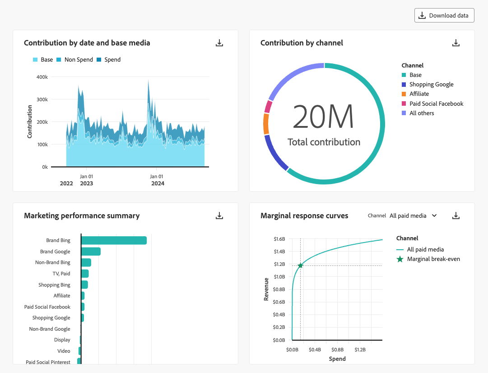
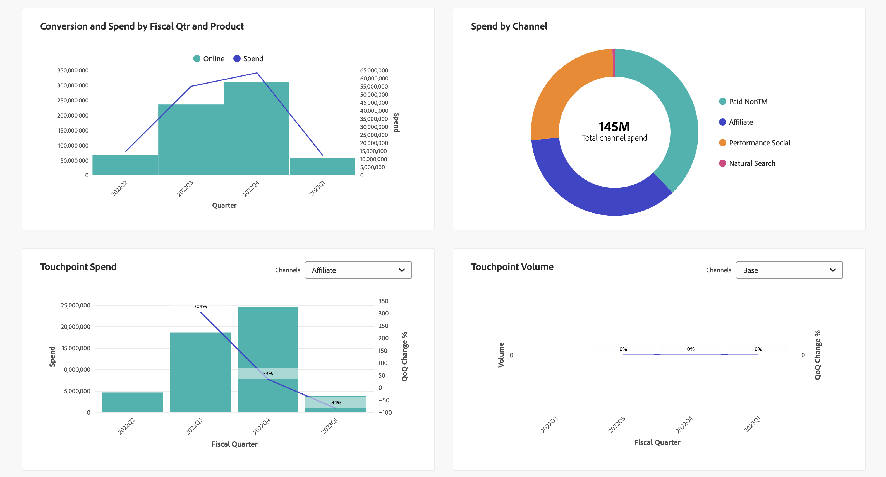

# Model Insights

So zeigen Sie Modelleinblicke im  **[!UICONTROL Models]** -Schnittstelle in Mix Modeler:

1. Aus dem **[!UICONTROL Models]** -Tabelle den Namen eines Modells auswählen, das über eine **[!UICONTROL Last run status]** von ● **[!UICONTROL Success]**.

1. Wählen Sie im Kontextmenü die Option **[!UICONTROL Model Insights]**.

Sie sehen, wann das angegebene Modell zuletzt aktualisiert wurde, und Widgets werden mit vier Registerkarten angezeigt: [Modelleinblicke](#model-insights), [Attribution](#attribution), [Diagnose](#diagnostics), und [Historische Übersicht](#historical-overview).

Sie können den Datumsbereich ändern, auf dem die Widgets auf den einzelnen Registerkarten basieren. Geben Sie einen Datumsbereich ein oder wählen Sie  , um einen Datumsbereich auszuwählen.

## [!UICONTROL Model insights]

Auf der Registerkarte Modelleinblicke werden Widgets für Folgendes angezeigt:

* Beitrag nach Datum und Basismedien Das gestapelte Diagramm ist geordnet: unten, in der Mitte die Kanäle ohne Ausgaben und oben die Kanäle für die Ausgabe.

* Beitrag nach Kanal

* Marketing-Leistungszusammenfassung.

* Kurven für die Randantwort.
   Wählen Sie einen Kanal aus dem **[!UICONTROL Channel]** Dropdown-Liste, um das Widget für einen bestimmten Kanal zu aktualisieren.

Sie können den Mauszeiger über einzelne Diagrammelemente in jedem Widget bewegen, um ein Popover mit weiteren Details anzuzeigen.

Um eine CSV-Datei mit den Daten für das Widget herunterzuladen, wählen Sie .

Um vollständige Modelleinblicke-Daten im Microsoft® Excel-Format herunterzuladen, wählen Sie  **[!UICONTROL Download data]**.

## [!UICONTROL Attribution]

Verwenden der [!UICONTROL Attribution] -Registerkarte können Sie die Effektivität von Touchpoints und Marketing-Kampagnen verstehen, die über Daten auf Ereignisebene verfügen. Die folgenden Attributionsmodelle werden unterstützt:

* Basierend auf dem ausgewählten Modell im Mix Modeler:
   * Algorithmus - Beeinflusst
   * Algorithmus - Inkrementell
* Regelbasiert:
   * Abbaueinheiten
   * Erstkontakt
   * Letztkontakt
   * Linear
   * Ushape

Siehe [Mehrkontaktattribution](../get-started/about.md#multi-touch-attribution) für eine Einführung in die Multi-Touch-Attributionsfunktion in Mix Modeler.

Wählen Sie ein oder mehrere Attributionsmodelle aus dem **[!UICONTROL Attribution Model]** Dropdown-Liste. Die ausgewählten Attributionsmodelle gelten für alle Widgets auf der Registerkarte Attribution .

Die granularen Ereigniswerte für die Mix Modeler-Mehrkontaktattribution richten sich an den Gesamtwerten und ROIs der Mix Modeler. Diese Bewertungen werden auch als Datensätze in Experience Platform bereitgestellt.

Die Registerkarte Attribution besteht aus den folgenden Widgets:

### [!UICONTROL Overview]

Die [!UICONTROL Overview] -Widget zeigt für die ausgewählten Attributionsmodelle die Konversionssummen und -prozentsätze an. Wenn Sie weitere Modelle auswählen, werden der Visualisierung zusätzliche Kreise hinzugefügt, von denen jede eine eigene Farbe hat, die der Legende entspricht.

Um ein Popup mit Details für ein Attributionsmodell anzuzeigen, bewegen Sie den Mauszeiger über einen der Kreise in der Visualisierung.

### [!UICONTROL Trends]

Die [!UICONTROL Daily trends], [!UICONTROL Weekly trends]oder [!UICONTROL Monthly trends] -Widget zeigt für die ausgewählten Attributionsmodelle die täglichen, wöchentlichen oder monatlichen Konversionstrends an.

Um den Zeitraum auszuwählen, wählen Sie **[!UICONTROL Daily trends]**, **[!UICONTROL Weekly trends]** oder **[!UICONTROL Monthly trends]** von .

Um Details anzuzeigen, bewegen Sie den Mauszeiger über die Datenzeile eines bestimmten Attributionsmodells, um ein Popover anzuzeigen, das die Gesamtanzahl der Konversionen für diese Daten anzeigt.

### [!UICONTROL Breakdown]

Die [!UICONTROL Breakdown] Widget ist eine Aufschlüsselung nach Kanal oder Touchpoint der Konversionen für jedes der ausgewählten Attributionsmodelle. Dieses Widget kann hilfreich sein, um Entscheidungen über die Effektivität der einzelnen Kanäle oder Touchpoints zu treffen.

Wählen Sie den Aufschlüsselungstyp aus. **[!UICONTROL Breakdown by channel]** oder **[!UICONTROL Breakdown by touchpoint]** von .

Um Details anzuzeigen, bewegen Sie den Mauszeiger über eines der Diagrammelemente.

### [!UICONTROL Top campaigns]

Das Widget Top-Kampagnen zeigt eine Tabelle der Top-Kampagnen mit Spalten für Kampagnenname, Kanal, Medientyp und inkrementelle Konversionen. Dieses Widget kann Ihr Team über die Effektivität einer bestimmten Kampagne für einen bestimmten Kanal informieren und Einblicke in die Kampagnen bieten, in die Sie weiter investieren sollten.

Um die Tabelle in aufsteigender ↑ oder absteigender Reihenfolge ↓ für Kanal, Medientyp oder Inkrementelle Konversionen zu sortieren, wählen Sie die Spaltenüberschrift aus und schalten Sie die Sortierung um.

Um die Tabelle in einem separaten Dialogfeld zu erweitern, wählen Sie **[!UICONTROL Expand]** von .

Im erweiterten Dialogfeld Top-Kampagnen wird dieselbe Tabelle mit Zusatzspalten für

* Inkrementelle Konversionen
* Beeinflusste Konversionen
* Erstkontaktkonversionen
* Letztkontakt-Konversionen

  Sie können jede der zusätzlichen Spaltenüberschriften auswählen, um die Tabelle in auf- oder absteigender Reihenfolge zu sortieren.

Um das erweiterte Dialogfeld &quot;Top-Kampagnen&quot;zu schließen, wählen Sie **[!UICONTROL Close]**.

### [!UICONTROL Breakdown by touchpoint position]

Die [!UICONTROL Breakdown by touchpoint position] visualisierung ist eine Aufschlüsselung der zugeordneten Konversionen nach Position des Touchpoints und Touchpoints über alle Konversionspfade hinweg. Dieses Diagramm hilft Ihnen dabei zu vergleichen, ob ein Touchpoint an einer Position besser beiträgt als verbleibende Positionen und andere Touchpoints an einer beliebigen Position.

>[!NOTE]
>
>Die Summe des prozentualen Beitrags für ein Attributionsmodell über alle Touchpoints und Positionen hinweg sollte 100 betragen.

Die Positionen [!UICONTROL Starter], [!UICONTROL Player] und [!UICONTROL Closer] werden wie folgt definiert:

| Position | Beschreibung |
|---|---|
| [!UICONTROL Starter] | Diese Position gibt an, ob der Touchpoint der Erstkontakt in einem Konversionspfad ist. |
| [!UICONTROL Player] | Diese Position gibt an, ob der Touchpoint nicht der erste oder letzte Kontakt ist, der zur Konversion führt. |
| [!UICONTROL Closer] | Diese Position gibt an, ob der Touchpoint der letzte Kontakt vor der Konvertierung ist. |

### [!UICONTROL Top conversion paths]

Die [!UICONTROL Top conversion paths] -Visualisierung zeigt die fünf wichtigsten Konversionspfade basierend auf den ausgewählten Attributionsmodellen an.

Für jeden Konversionspfad sehen Sie Folgendes:

* die Anzahl der Kanäle, die Auswirkungen haben,
* die insgesamt zugewiesenen Pfade,
* der Prozentsatz der zugeordneten Pfade für diesen Konversionspfad im Vergleich zu den insgesamt zugeordneten Pfaden,
* für jeden Kanal den Prozentsatz des Beitrags des Attributionsmodells und
* die Summe dieser Beitragsprozentsätze des Kanalattributionsmodells.

## [!UICONTROL Diagnostics]

Auf der Registerkarte Diagnose werden Widgets für folgende Aufgaben angezeigt:

* [!UICONTROL Model Assessment] Visualisierung, die Sie auf tatsächliche oder prognostizierte oder Restkonversionen aufschlüsseln können.

  Um die Visualisierung aufzuschlüsseln, wählen Sie **[!UICONTROL Actual vs. Predicted]** oder **[!UICONTROL Residuals]** aus dem **[!UICONTROL Breakdown]** Liste.

* [!UICONTROL Model fitting metrics] -Tabelle mit den folgenden Spalten für jede Konversionsmetrik:

   * Tatsächliche Konversion

   * Modellierte Konversion

   * Restkonvertierung (Differenz zwischen tatsächlicher und modellierter Konversion)

   * Modellqualitätswerte:

      * R2 (R-squared), das angibt, wie gut die Daten zum Regressionsmodell passen (die Anpassungsgüte).

      * MAPE (Mean Absolute Percentage Error), einer der am häufigsten verwendeten KPIs zur Messung der Prognosegenauigkeit und zum Ausdruck des Prognosefehlers als Prozentsatz des tatsächlichen Werts.

      * RMSE (Root Mean Square Error): Zeigt den durchschnittlichen Fehler an, der nach dem Quadrat des Fehlers gewichtet wird.

  Um eine CSV-Datei herunterzuladen, die die Daten für die Tabelle enthält, wählen Sie .

* [!UICONTROL Touchpoint effectiveness] -Tabelle, die das Ergebnis des algorithmischen Attribution AI-Modells darstellt. Die Daten für diese Tabelle werden nur für bestimmte Zeiträume generiert. Auswählen **[!UICONTROL As of *xx/xx/xx, xx:xx TZ *]** für weitere Details.

  Die Visualisierung zeigt in absteigender Reihenfolge [!UICONTROL Efficiency measure] für jeden Touchpoint:

   * [!UICONTROL Paths touched]: visualisiert den Prozentsatz der Pfade, die Konversionen erzielen, und den Prozentsatz der Pfade, die keine Konversion erzielen. Bei einem Touchpoint sehen Sie mehr zugeordnete Konversionen, wenn das Attributionskonversionsverhältnis hoch ist. Dieses Verhältnis vergleicht den Prozentsatz der Pfade, die zur Konversion führen, mit dem Prozentsatz der Pfade, die dies tun *not* zur Konversion führen.
   * [!UICONTROL Efficiency measure]: Wird durch das algorithmische Attributionsmodell generiert, zeigt die Effizienzmessung die relative Bedeutung eines Touchpoints zur Konversion an, unabhängig vom Touchpoint-Volumen. Der Wirkungsgrad wird auf einer Skala von 1 bis 5 gemessen. Beachten Sie, dass ein höheres Touchpoint-Volumen keine höhere Effizienz garantiert.
   * [!UICONTROL Total volume]: Die aggregierte Anzahl der Touchpoints eines Benutzers. Die Anzahl umfasst Touchpoints, die auf einem Pfad angezeigt werden, der Konversionen erreicht, sowie Pfade *not* , was zu einer Konversion führt.

## [!UICONTROL Historical overview]

Die Registerkarte Historische Übersicht zeigt Widgets für:

* Konversion und Ausgaben nach Fiscal Qtr und Produkt.

* Ausgaben nach Kanal

* Touchpoint-Ausgaben.

  Sie können einen alternativen ausgabenbasierten Kanal auswählen, der für dieses Widget angezeigt werden soll. Wählen Sie einen Kanal aus **[!UICONTROL Channels]**.

* Touchpoint-Lautstärke.

  Sie können einen alternativen volumenbasierten Kanal auswählen, der für dieses Widget angezeigt werden soll. Wählen Sie einen Kanal aus **[!UICONTROL Channels]**.

