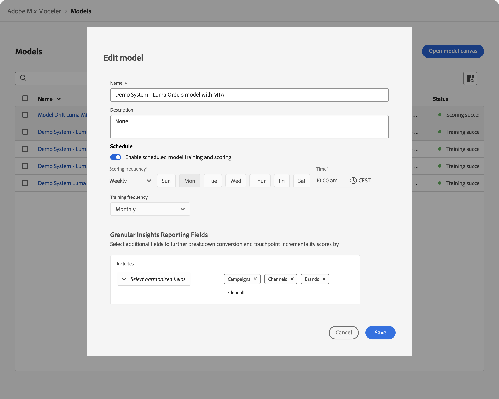

# Modelle - Übersicht

Mit der Modellfunktion in Mix Modeler können Sie Modelle konfigurieren, trainieren und bewerten, die speziell auf Ihre Geschäftsziele zugeschnitten sind. Das Training und Scoring unterstützt KI-gestütztes Transferlernen zwischen Multitouch-Attribution und Marketing-Mix-Modellierung.

Die Modelle basieren auf den harmonisierten Daten, die Sie im Rahmen des Programm-Workflows erstellen.

Ein Modell in Mix Modeler ist ein maschinelles Lernmodell, mit dem ein bestimmtes Ergebnis anhand der Investitionen eines Marketing-Experten gemessen und vorhergesagt werden kann. Marketing-Touchpoints und Daten auf Zusammenfassungsebene können als Eingabe verwendet werden. Mit Mix Modeler können Sie Varianten von Modellen erstellen, die auf verschiedenen Variablensätzen, Dimensionen und Ergebnissen basieren, z. B. Umsatz, verkaufte Einheiten, Leads.

Ein Modell erfordert:

* Eine Konversion.
* Ein oder mehrere Marketing-Touchpoints (Kanäle), die aus Daten auf Zusammenfassungsebene, Marketing-Touchpoint-Daten (Ereignisdaten) oder beidem bestehen.
* Ein konfigurierbares Lookback-Fenster.
* Ein konfigurierbares Trainings-Fenster.

Ein Modell kann optional Folgendes enthalten:

* Externe Faktoren.
* Interne Faktoren.
* Vorkenntnisse von Marketing-Beiträgen aus anderen Quellen wie Erfahrungen mit früheren Stakeholdern, inkrementelle Tests und andere Modelle.
* Ausgabenanteil, der den relativen Ausgabenanteil als Proxy verwendet, wenn die Marketing-Daten spärlich sind.

Wenn ein Modell zum ersten Mal erstellt wird, startet die Erstellung sofort den Trainings- und Bewertungsprozess. Nach Abschluss des anfänglichen Trainings- und Scoring-Durchgangs stehen Modelleinblicke zur Überprüfung zur Verfügung. Ein Modell kann anschließend neu trainiert werden. Außerdem können Daten zum Modell hinzugefügt werden, sodass Sie das Modell manuell neu bewerten müssen. Umschulung und Neubewertung sind ein iterativer Prozess, da neue Erkenntnisse und Informationen auftauchen und Anpassungen erforderlich sind, um eine Modellanpassung zu erhalten, die für Ihre Geschäftsziele am besten geeignet ist.

## Erstellen von Modellen

Verwenden Sie zum Erstellen eines Modells den Schritt-für-Schritt-Konfigurationsablauf für Mix Modeler-Modelle, der bei der Auswahl von **[!UICONTROL Open model canvas]** verfügbar ist. Weitere [&#x200B; finden Sie unter &#x200B;](build.md) von Modellen .

## Modelle verwalten

So zeigen Sie eine Tabelle Ihrer aktuellen Modelle in der Benutzeroberfläche von Mix Modeler an:

1. Wählen Sie -**[!UICONTROL Models]** in der linken Leiste aus.

1. Eine Tabelle der aktuellen Modelle wird angezeigt.

   Die Tabellenspalten geben Details zum Modell an.

   | Spaltenname | Details |
   |---|---|
   | **[!UICONTROL Name]** | Modellname |
   | **[!UICONTROL Description]** | Beschreibung des Modells |
   | **[!UICONTROL Conversion event]** | Die für das Modell ausgewählte Konvertierung. |
   | **[!UICONTROL Run frequency]** | Die Lauffrequenz des Trainings des Modells. |
   | **[!UICONTROL Last run]** | Datum und Uhrzeit des letzten Trainings des Modells. |
   | **[!UICONTROL Status]** | Der Status des Modells. |

   Um die Tabelle in einer beliebigen Spalte in aufsteigender  oder absteigender Reihenfolge  zu sortieren, klicken Sie auf den Titel der Spalte.

   Um die **[!UICONTROL Name]** Spalte zu sortieren oder zu skalieren, wählen Sie **[!UICONTROL Name]** ChevronDown. Wählen Sie im Kontextmenü **[!UICONTROL Sort ascending]**, **[!UICONTROL Sort descending]** oder **[!UICONTROL Resize column]** aus. Alternativ können Sie den Mauszeiger über das Spaltentrennzeichen bewegen, um die Größe der **[!UICONTROL Name]** Spalte zu ändern.

   Der gemeldete Status des Modells hängt davon ab, wo sich ein Modell innerhalb seines Lebenszyklus befindet. Ob beispielsweise ein Modell erstellt, erfolgreich (neu) trainiert wurde oder nicht oder ob die Bewertung erfolgreich (neu) erstellt wurde oder nicht.

   In der folgenden Tabelle:

   *  - zeigt eine erfolgreiche Ausführung eines Schritts im Modelllebenszyklus an.
   *  - zeigt die aktuelle Ausführung eines Schritts im Modelllebenszyklus an.
   *  - zeigt eine fehlgeschlagene Ausführung eines Schritts im Modelllebenszyklus an.

   | Status | [Build](/help/models/build.md) | [Zug](/help/models/train-score.md#train) | [Ergebnis](/help/models/train-score.md#score) | [Umschulen](/help/models/train-score.md#train) | [Rescore](/help/models/train-score.md#score) |
   |---|:---:|:---:|:---:|:---:|:---:|
   | In Bearbeitung |  | | | | |
   | In Bearbeitung |  |  | | | |
   | In Bearbeitung |  |  |  | | |
   | In Bearbeitung |  |  |  |  | |
   | In Bearbeitung |  |  |  |  |  |
   | Training failed |  |  | | | |
   | Training failed |  |  |  |  | |
   | Training successful |  |  | | | |
   | Training successful |  |  |  |  | |
   | Bewertung fehlgeschlagen |  |  |  | | |
   | Bewertung fehlgeschlagen |  |  |  |  |  |
   | Bewertung erfolgreich |  |  |  | | |
   | Bewertung erfolgreich |  |  |  |  |  |

   {style="table-layout:fixed"}

1. Um die für die Liste angezeigten Spalten zu ändern, wählen Sie  aus und schalten Sie die Spalten ein  oder aus.

Sie können die folgenden Aktionen für ein bestimmtes Modell ausführen.

### Modelleinblicke

Die Funktion Modelleinblicke ist nur für erfolgreich trainierte und bewertete Modelle verfügbar.

So zeigen Sie die Insights eines Modells an:

1. Wählen Sie -**[!UICONTROL Models]** in der linken Leiste aus.
1. Wählen Sie den Modellnamen.

Sie werden zu &quot;[&#x200B; Insights“ &#x200B;](insights.md).

### Details anzeigen

So zeigen Sie weitere Details zu einem Modell an:

1. Wählen Sie -**[!UICONTROL Models]** in der linken Leiste aus.

1. Wählen Sie  für ein Modell aus, um ein Popup mit Details anzuzeigen.

### Duplizieren

Sie können ein Modell schnell duplizieren.

1. Wählen Sie -**[!UICONTROL Models]** in der linken Leiste aus.

1. Wählen Sie  für ein Modell aus und wählen Sie im Kontextmenü **[!UICONTROL Duplicate]** aus.

Sie werden zu den Schritten zum Erstellen eines neuen Modells weitergeleitet, wobei ein vorgeschlagener Name aus dem Namen des ursprünglichen Modells mit **[!UICONTROL (Copy)] (_)_ wird**.

### Bearbeiten

Sie können den Namen, die Beschreibung und den Zeitplan für das Training und die Bewertung eines Modells bearbeiten.

1. Wählen Sie -**[!UICONTROL Models]** in der linken Leiste aus.

1. Wählen Sie  für ein Modell aus und wählen Sie im Kontextmenü **[!UICONTROL Edit]** aus.

   Im Dialogfeld **[!UICONTROL Edit model]** :

   

   * Geben Sie einen neuen **[!UICONTROL Name]** und eine neue **[!UICONTROL Description]** ein.

   * Um die Zeitplanung zu aktivieren, aktivieren Sie **[!UICONTROL Enable schedule model training and scoring]**. Sie können die Planung nur für Modelle aktivieren, die trainiert und bewertet wurden.

      1. **[!UICONTROL Scoring frequency]** auswählen:

         * **[!UICONTROL Daily]**: Geben Sie eine gültige Zeit ein (z. B. `10:00 am`) oder verwenden Sie , um die Zeit festzulegen.
         * **[!UICONTROL Weekly]**: Wählen Sie einen Wochentag aus und geben Sie eine gültige Zeit ein (z. B. `10:00 am`) oder verwenden Sie , um die Zeit festzulegen.
         * **[!UICONTROL Monthly]**: Wählen Sie einen Tag des Monats aus dem Dropdown-Menü Ausführen für jedes Dropdown-Menü aus und geben Sie eine gültige Zeit ein (z. B. `10:00 am`) oder verwenden Sie , um die Zeit festzulegen.

      1. Wählen Sie eine **[!UICONTROL Training frequency]** aus dem Dropdown-Menü aus: **[!UICONTROL Monthly]**, **[!UICONTROL Quarterly]**, **[!UICONTROL Yearly]** oder **[!UICONTROL None]**.

   * So aktualisieren Sie die [Berichtsfelder für granulare Insights](/help/models/build.md#granular-insights-reporting-fields) im **[!UICONTROL Granular Insights Reporting Fields]** Abschnitt:
      1. Wählen Sie ein oder mehrere harmonisierte Felder aus dem **[!UICONTROL _Harmonisierte Felder auswählen_]** unter **[!UICONTROL Includes]** aus. Die ausgewählten harmonisierten Felder werden dem Bedienfeld hinzugefügt.
      1. Wählen Sie **[!UICONTROL *Harmonisiertes Feld *]** aus, um ein harmonisiertes Feld aus dem Container mit den ausgewählten harmonisierten Feldern zu entfernen.
      1. Wählen Sie **[!UICONTROL Clear all]** aus, um alle ausgewählten harmonisierten Felder zu entfernen.

     >[!IMPORTANT]
     >Wenn Sie granulare Insights-Reporting-Felder zu einem Modell hinzufügen, das **vor dem 18. Februar**) erstellt wurde, ist eine Neubewertung des Modells erforderlich. Diese Bewertung stellt sicher, dass das dem Modell zugrunde liegende Schema mit granularen Insights-Reporting-Feldern aktualisiert wird.
     >
     >Es wird empfohlen, ein solches Modell zu duplizieren. Und schließen Sie die granularen Insights-Reporting-Felder in die Erstellung des duplizierten Modells ein.
     >

1. Wählen Sie **[!UICONTROL Save]** aus.

### trainieren

Trainieren Sie ein Modell neu, wenn Sie neue inkrementelle Marketing- und Faktordaten einbeziehen möchten. Weitere Informationen finden [&#x200B; unter &#x200B;](train-score.md#train) trainieren und bewerten .

### Ergebnis

Sie können ein Modell inkrementell auf der Grundlage neuer Marketing-Daten bewerten oder ein Modell für einen bestimmten Datumsbereich neu bewerten. Weitere Informationen finden [&#x200B; unter &#x200B;](train-score.md#score) trainieren und bewerten .

### Modelle löschen

Löschen eines Modells:

1. Wählen Sie -**[!UICONTROL Models]** in der linken Leiste aus.
1. Wählen Sie  für ein Modell aus und wählen Sie im Kontextmenü **[!UICONTROL Delete]** aus. Wählen Sie alternativ Löschen“ **[!UICONTROL Delete]**.
1. Wählen Sie **[!UICONTROL Delete]** im Bestätigungsdialogfeld **[!UICONTROL Delete model]** aus, um das Modell zu löschen. Wählen Sie zum Abbrechen **[!UICONTROL Cancel]** aus.

So löschen Sie mehrere Modelle:

1. Mehrere Modelle auswählen.
1. Wählen Sie in der blauen Aktionsleiste die Option  aus, **[!UICONTROL Delete]** die Modelle zu löschen.
1. Wählen Sie **[!UICONTROL Delete]** im Bestätigungsdialogfeld **[!UICONTROL Delete *x *-Modelle]**, um die Modelle zu löschen. Wählen Sie zum Abbrechen **[!UICONTROL Cancel]**&#x200B;aus.

