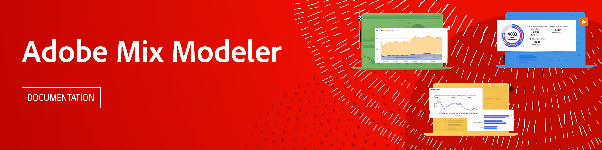

# Adobe Mix Model-Handbuch

Dieses Handbuch zur technischen Dokumentation bietet Selbsthilfe für **Adobe Mix Model**. Mix Modeler ist eine Adobe Experience Cloud-Anwendung, die Kampagnen ganzheitlich misst und die Planung über alle Kanäle hinweg optimiert: bezahlt, verdient und eigenverantwortlich. Mix Modeler basiert auf Adobe Experience Platform und wird von Adobe Sensei unterstützt.

>[!AVAILABILITY]
>
>Das Produkt wird Ende 2023 verfügbar sein. Die Entwurfsdokumentation finden Sie hier.

## Erste Schritte

* Was ist [Mix-Modelle](get-started/about.md)?

* Was ist ein typisches [Anwendungs-Workflow](get-started/workflow.md)?

<!--
## Concepts

<table style="table-layout:fixed">
<tr>
    <td valign="top">
        
    

    <a href="/help/ingest-data/datasets.md"><strong>Datasets</strong></a>
    

    <em>Find out the various tools that you can use to troubleshoot your journeys.</em>
     
  </td>
  <td valign="top">
    
    

    <a href="using/usecase/building-the-journey.md"><strong>Use case</strong></a>
    

    <em>Learn how to create an advanced journey step-by-step.</em>
     
  </td>
  <td valign="top">
    
    

    <a href="using/expression/expressionadvanced.md"><strong>Building advanced expressions</strong></a>
    

    <em>Learn how to build complex expressions leveraging data from events and data sources. </em>
     
  </td>
</tr>
</table>
-->
