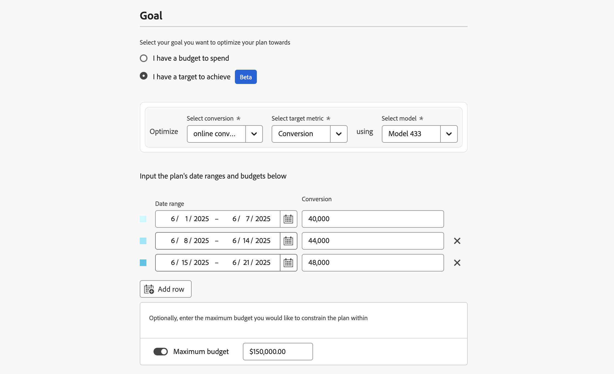

# Pläne erstellen

In Mix Modeler erstellen Sie einen Plan mit dem Planassistenten. Im Planassistenten können Sie die Details und Budgets oder Zielmetriken Ihres Plans und das zugrunde liegende Modell einrichten, das für Ihren Plan verwendet werden soll. Nachdem Sie Details, Budget, Zielmetriken und Modell angegeben haben, können Sie mit einem von KI empfohlenen Plan fortfahren oder die Ausgaben nach Kanal bearbeiten. Sie haben die Möglichkeit, erweiterte Konfigurationen für den durchschnittlichen Umsatz pro Konversions- und Kanalkosten zu definieren.

Sie müssen das Ziel definieren, für das Sie Ihren Plan maximieren möchten. Dieses Ziel kann entweder ein Budget sein, das Sie ausgeben können, oder ein Ziel, das Sie erreichen möchten. Wenn das Ziel eine Zielgruppe ist, müssen Sie außerdem Werte für die zu verwendende Zielmetrik angeben: Konversion, Umsatz, CPA oder ROI.

Um einen Plan zu erstellen, wählen Sie in der -**[!UICONTROL Plans]** in Mix Modeler **[!UICONTROL Create plan]** aus.

1. Im **[!UICONTROL Plan creation]**:

   1. Im **[!UICONTROL Setup]** Abschnitt:

      1. Geben Sie einen **[!UICONTROL Plan name]** ein, z. B. `Goal based plan`. Geben Sie einen **[!UICONTROL Description]** ein, z. B. `A goal based plan`.
      1. Wählen Sie eine **[!UICONTROL Model]** aus **[!UICONTROL _Option auswählen…_,]**

         

   1. Wählen Sie im Abschnitt **[!UICONTROL Goal]** das Ziel aus, für das Sie Ihren Plan optimieren möchten. Folgende Optionen stehen zur Auswahl

      * **[!UICONTROL I have a budget to spend]**

        

        Mit dieser Option können Sie Budgets für einen oder mehrere Datumsbereiche eingeben.

         1. Im **[!UICONTROL Optimize]** Container:
            1. Wählen Sie im Dropdown-Menü **[!UICONTROL Select conversion]** eine Konvertierung aus.
            1. Wählen Sie ein Modell aus dem Dropdown-Menü **[!UICONTROL Select model]** aus.
         1. Geben Sie einen **[!UICONTROL Date range]** an, entweder durch Eingabe von Datumsangaben oder Auswahl eines Datumsbereichs mithilfe von .
         1. Geben Sie einen **[!UICONTROL Budget]** ein.
Um zusätzliche Datumsbereiche mit jeweils ihrem Budget hinzuzufügen, wählen Sie  **[!UICONTROL Add row]**.
Um einen Datumsbereich und das zugehörige Budget zu löschen, wählen Sie .
         1. So definieren Sie ein optionales Maximalbudget, innerhalb dessen Sie den Plan einschränken möchten:
            1. Schalten Sie **[!UICONTROL Maximize budget]** ein.
            1. Geben Sie den Betrag des maximalen Budgets an. Der Betrag sollte gleich oder höher als der Gesamtbetrag der für die Datumsbereiche angegebenen Budgets sein.

      * **[!UICONTROL I have a target to achieve]** [!BADGE Beta]

        

         1. Im **[!UICONTROL Optimize]** Container
            1. Wählen Sie im Dropdown-Menü **[!UICONTROL Select conversion]** eine Konvertierung aus.
            1. Wählen Sie im Dropdown-Menü **[!UICONTROL Select target metric]** eine Zielmetrik aus. Sie können zwischen **[!UICONTROL Conversion]**, **[!UICONTROL CPA]**, **[!UICONTROL Revenue]** oder **[!UICONTROL ROI]** wählen.
            1. Wählen Sie ein Modell aus dem Dropdown-Menü **[!UICONTROL Select model]** aus.
         1. Geben Sie einen Datumsbereich an, indem Sie entweder Daten eingeben oder einen Datumsbereich mithilfe von  auswählen.
         1. Geben Sie einen Wert für die ausgewählte Zielmetrik ein. Beispiel: eine Zahl für **[!UICONTROL Conversion]**, ein Prozentsatz für **[!UICONTROL ROI]** oder Währungswerte für **[!UICONTROL CPA]** und **[!UICONTROL Revenue]**.
Um zusätzliche Datumsbereiche mit jeweils ihrer Zielmetrik hinzuzufügen, wählen Sie  **[!UICONTROL Add row]** aus.
Um einen Datumsbereich und die zugehörige Zielmetrik zu löschen, wählen Sie  aus.
         1. So definieren Sie ein optionales Maximalbudget, innerhalb dessen Sie den Plan einschränken möchten:
            1. Schalten Sie **[!UICONTROL Maximize budget]** ein.
            1. Geben Sie den Betrag des maximalen Budgets an.

   1. Wählen Sie **[!UICONTROL Next]** aus.

1. Im Dialogfeld **[!UICONTROL Done with all required fields]** :

   

   * Wählen Sie  **[!UICONTROL Create plan now]** aus, wenn Sie einen von KI empfohlenen Plan mit prognostiziertem ROI generieren möchten. Wählen Sie **[!UICONTROL OK]** aus. Ihr Plan wird erstellt.

   * Wählen Sie  aus **[!UICONTROL Edit channel budgets first]** wenn Sie das Kanalbudget bearbeiten und erweiterte Konfigurationen definieren möchten, bevor ein Plan mit prognostiziertem ROI erstellt wird.  Wählen Sie **[!UICONTROL OK]** aus, damit Sie im nächsten Schritt Ihre Kanalausgaben in **[!UICONTROL Spend selection]** definieren können.

     >[!IMPORTANT]
     >
     >Die folgenden Informationen sind nur relevant, wenn Sie die **[!UICONTROL Edit channel budgets first]**  ausgewählt haben

1. Verwenden Sie im **[!UICONTROL Spend selection]** Abschnitt für jeden Budgetdatumsbereich den , um die Kanalverteilungsansicht für diesen Datenbereich zu öffnen.

   Sie können historische Referenzdaten verwenden, wenn Sie vergangene Marketing-Ausgabendaten und -Erkenntnisse verwenden möchten. Betrachten Sie historische Referenzdaten für Folgendes:

   * Verbessern Sie die Budgetzuweisung durch Hervorhebung leistungsstarker Kanäle und leistungsschwacher Kanäle.
   * Unterstützung der Trendanalyse.
   * Identifizieren Sie effektive Strategien und vermeiden Sie Fehler bei der Konfiguration von Plänen.

   Wenn Sie einen historischen Referenzzeitraum auswählen, richten Sie sich nach den Voreinstellungen für frühere Ausgabenmuster aus, und die Planungsfunktion von Mix Modeler kann Pläne generieren, die Ihren Erwartungen entsprechen. Diese Pläne sollten letztendlich das Vertrauen der Stakeholder stärken, sicherstellen, dass Marketing-Pläne strategisch und effizient sind und dass diese Pläne auf bewährten Leistungsdaten und Geschäftsanforderungen basieren.

   

   1. Wählen Sie die **[!UICONTROL Spend pattern]**.

      * Die Standardoption ist **[!UICONTROL Automatic]**.
      * Wählen Sie **[!UICONTROL Historical reference]** aus und geben Sie einen **[!UICONTROL Start date]** ein, um auf frühere, Mix Modeler bereits verfügbare Marketing-Ausgabendaten zu verweisen. Der **[!UICONTROL End date]** wird automatisch anhand des Datumsbereichs bestimmt, für den Sie das Ausgabenmuster definieren. Das vorgeschlagene Startdatum ist das erste verfügbare Datum für Marketingausgaben, das nach diesem Datum liegt. Um anzuzeigen, dass Sie einen nicht vorhandenen oder ungültigen historischen Referenzzeitraum ausgewählt haben, wird ein  angezeigt.

   1. Um Budgets für jeden Kanal zu definieren, geben Sie einen Wert für **[!UICONTROL Min]** und **[!UICONTROL Max]** ein oder verwenden Sie die Schieberegler.

   1. Um zwischen Eingabe von Währung oder Prozentsatz umzuschalten, wählen Sie **[!UICONTROL $]** oder **[!UICONTROL %]** für **[!UICONTROL View spend by]** aus. Dieser Umschalter ist deaktiviert, wenn Sie Zielmetriken ausgewählt haben, die nicht währungsbasiert sind.

   1. Wenn Sie fertig sind, wählen Sie **[!UICONTROL Create]** aus.

      

   1. Wählen Sie **[!UICONTROL Next]** aus.

1. Im Abschnitt **[!UICONTROL Advanced configurations]** können Sie optionale erweiterte Konfigurationen eingeben.

   

   * Ihr Planname , Modell, Datumsbereich und Gesamtbudget sind zusammengefasst.

   * Standardmäßig berechnet Mix Modeler den durchschnittlichen Umsatz pro Konversion automatisch anhand der neuesten saisonalen Verlaufsdaten. In **[!UICONTROL Average Revenue per conversion]** können Sie den spezifischen durchschnittlichen Umsatz pro Konversion definieren.

      1. Für jeden Datumsbereich in Ihrem Budget:

         1. Wählen Sie im Dropdown-Menü **[!UICONTROL Date range]** einen Datumsbereich aus.
         1. Geben Sie einen **[!UICONTROL Average revenue]** Wert ein.

      1. Wählen Sie  Benutzerdefinierten durchschnittlichen Umsatz pro Konversionseinheit hinzufügen , um einen Datumsbereich hinzuzufügen.
      1. Wählen Sie  aus, um einen Datumsbereich zu entfernen.

     >[!NOTE]
     >
     >Wenn Ihr Modell keine historischen Umsatzdaten enthält, müssen Sie für jeden Datumsbereich, den Sie für Ihr Budget angegeben haben, einen durchschnittlichen Umsatz pro Konversion definieren.
     >

   * Standardmäßig berechnet Mix Modeler die Kanalkosten automatisch anhand der neuesten saisonalen Verlaufsdaten. In **[!UICONTROL Channel costs]** können Sie benutzerdefinierte Kanalkosten definieren.

      1. Definieren Sie für jeden Kanal in Ihrem Modell benutzerdefinierte Kanalkosten.

         1. Wählen Sie einen Kanal aus dem Dropdown-Menü **[!UICONTROL Channel]** aus.
         1. Für jeden Datumsbereich in Ihrem Budget:
            1. Wählen Sie im Dropdown-Menü **[!UICONTROL Date range]** einen Datumsbereich aus.
            1. Geben Sie einen **[!UICONTROL Average revenue]** Wert ein.
         1. Wählen Sie -**[!UICONTROL Add custom average revenue per conversion unit]** aus, um einen Datumsbereich hinzuzufügen.
         1. Wählen Sie  aus, um einen Datumsbereich zu entfernen.

      1. Wählen Sie -**[!UICONTROL Add custom channel cost]** aus, um einen Kanal hinzuzufügen.
      1. Wählen Sie  aus, um einen benutzerdefinierten Kanal zu entfernen.

1. Wenn Sie fertig sind, wählen Sie **[!UICONTROL Create]** aus.

1. Wählen Sie im Dialogfeld **[!UICONTROL Create plan]** die Option **[!UICONTROL Create plan]** aus, um Ihren Plan zu erstellen. Wählen Sie **[!UICONTROL Cancel]** aus, um die Erstellung Ihres Plans abzubrechen. Zur Bestätigung wird ein **[!UICONTROL No work is saved]** Dialogfeld angezeigt.

