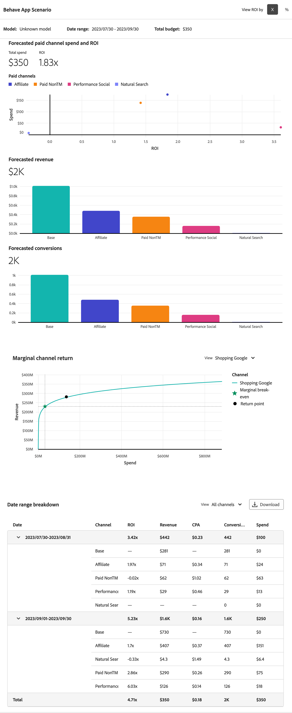
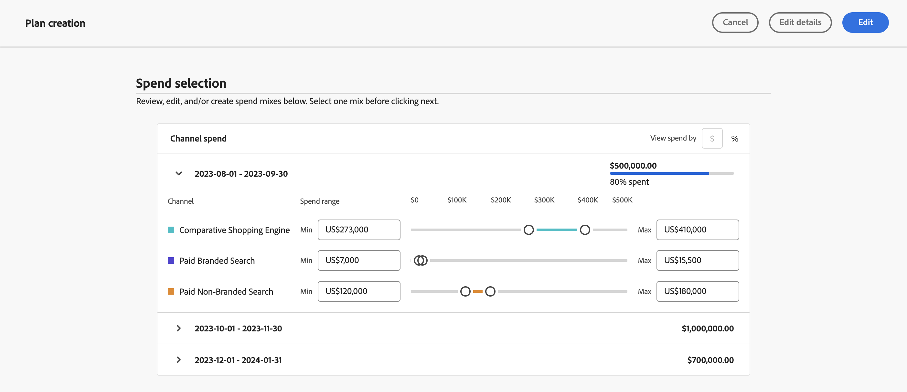

# Plan bearbeiten

Um einen Plan zu bearbeiten, klicken Sie im  **[!UICONTROL Plans]** -Benutzeroberfläche in Mix Modeler verwenden, wählen Sie Ihren Plan anhand seines Namens aus.

In [!UICONTROL Plan insights], werden Ihre Planeinblicke erstellt und zeigen die [!UICONTROL Model], die [!UICONTROL Data range], und [!UICONTROL Total budget] auf der der Plan beruht.

Wenn Sie das Abrufen abgeschlossen haben, erhalten Sie einen Überblick über Ihren Plan mit Visualisierungen für [!UICONTROL Forecasted ROI] und [!UICONTROL Forecasted revenue].

1. Auswählen **[!UICONTROL Close]** , um zur Oberfläche Pläne zurückzukehren.

1. (optional) Wählen Sie **[!UICONTROL Plan breakdown]** um eine Aufschlüsselungstabelle Ihres Plans anzuzeigen.

   

1. Um Ihren Plan zu bearbeiten, wählen Sie **[!UICONTROL Edit plan]**:

   1. Im **[!UICONTROL Spend selection]** verwenden, verwenden Sie für jeden Budgetdatumsbereich die  , um die Kanalverteilungsansicht für diesen Datenbereich zu öffnen.

   1. Um die Budgets für jeden Kanal zu ändern, ändern Sie die Werte für **[!UICONTROL Min]** und **[!UICONTROL Max]** oder benutzen Sie die Regler.

   1. Um zwischen Währungs- oder Prozenteingabe umzuschalten, wählen Sie **[!UICONTROL $]** oder **[!UICONTROL %]** für **[!UICONTROL View spend by]**.

      

   1. Um die Details Ihres Plans zu bearbeiten, wählen Sie **[!UICONTROL Edit details]**:

      1. Im **[!UICONTROL Setup]** ändern Sie gegebenenfalls die **[!UICONTROL Plan name]** und **[!UICONTROL Description]**.

      1. Im **[!UICONTROL Budget]** Abschnitt:

         1. Ändern Sie die **[!UICONTROL Date range]** für einen oder mehrere der Datumsbereiche Ihres Plans festlegen, indem Sie entweder Datumsangaben eingeben oder einen Datumsbereich auswählen, indem Sie .

         1. Ändern Sie die **[!UICONTROL Budget]** einen oder mehrere der Datumsbereiche Ihres Plans festlegen.

         Um zusätzliche Datumsbereiche hinzuzufügen, wählen Sie jeden mit dem Budget aus.  **[!UICONTROL Add row]**.

         Um einen Datumsbereich und das zugehörige Budget zu löschen, wählen Sie .

         So legen Sie ein Höchstbudget fest:

         1. Switch **[!UICONTROL Maximize budget]** auf.
         1. Geben Sie den Höchstbetrag an. Der Betrag sollte dem Gesamtbudget entsprechen oder darüber liegen, der für die Datumsbereiche angegeben wurde.

      1. Auswählen **[!UICONTROL Next]** , um zu **[!UICONTROL Spend]** Abschnitt. Auswählen **[!UICONTROL Cancel]** zurück, um zur Übersicht Ihrer Pläne zurückzukehren.

         

1. Wenn Sie den Plan fertig bearbeitet haben, wählen Sie **[!UICONTROL Edit]**.

   Im **[!UICONTROL All changes are final]** Dialogfeld auswählen **[!UICONTROL OK]** Aktualisierung der aktuellen Ausgaben- und ROI- sowie Umsatzprognosen des Plans. Auswählen **[!UICONTROL Cancel]** , um die Aktualisierung Ihres Plans abzubrechen.

1. Um Ihre Planaktualisierungen abzubrechen, wählen Sie **[!UICONTROL Cancel]**.

   Im **[!UICONTROL No work will be saved]** Dialogfeld auswählen **[!UICONTROL Cancel]** um mit der Arbeit an Ihrem Plan fortzufahren oder **[!UICONTROL OK]** , um zur Benutzeroberfläche &quot;Pläne&quot;zurückzukehren.

