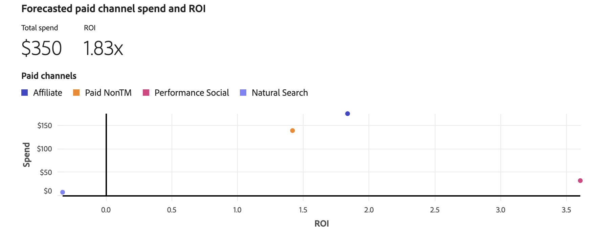

# Planerkenntnisse

[!UICONTROL Plan insights] werden Ihre Planeinblicke erstellt, die die [!UICONTROL Model], die [!UICONTROL Data range] und die [!UICONTROL Plan target] zeigen, auf denen der Plan basiert.

Wenn die Einblicke erstellt werden, erhalten Sie einen Überblick über Ihren Plan, der aus folgenden Elementen besteht:

- Eine Kopfzeile, die den [!UICONTROL Model], die [!UICONTROL Data range] und die [!UICONTROL Plan target] anzeigt, auf der der Plan basiert.
   - Wenn Sie einen zielbasierten Plan definiert haben, zeigt ein Abzeichen den Status Ihrer Zielgruppe an. Mögliche Optionen sind:

      - [!BADGE Ziel erreichbar]{type=Positive}
      - [!BADGE Ziel nicht erreichbar]{type=Negative}

   - Wählen Sie  **[!UICONTROL Show more]** aus, um weitere Details anzuzeigen.

- [Visualisierung [!UICONTROL Forecasted paid channel ROI]](#forecasted-paid-channel-spend-and-roi)
- [Visualisierung [!UICONTROL Forecasted revenue]](#forecasted-revenue)
- [Visualisierung [!UICONTROL Forecasted conversion]](#forecasted-conversions)
- [Visualisierung [!UICONTROL Marginal channel return]](#marginal-channel-return)
- [[!UICONTROL Data range breakdown] Tabelle des Plans](#date-range-breakdown) mit Spalten für

   - Kanal
   - ROI
   - CPA
   - Einnahmen
   - Konversionsziel
   - Ausgaben

Um die Benutzeroberfläche zu schließen, klicken Sie auf **[!UICONTROL Close]**.

Um den ROI Ihres Plans anzuzeigen, wählen Sie **[!UICONTROL X]** oder **[!UICONTROL &#x200B; %]** unter **[!UICONTROL View ROI]** aus.

## Prognostizierte Ausgaben und ROI für bezahlte Kanäle

Diese Visualisierung zeigt ein Streudiagramm für die prognostizierten Ausgaben und den prognostizierten ROI auf Ihren Paid-Kanälen, basierend auf dem Modell, dem Datumsbereich und dem Budget.

## Prognostizierter Umsatz

Diese Balkendiagramm-Visualisierung zeigt den prognostizierten Umsatz für Ihre Kanäle basierend auf dem Modell, dem Datumsbereich und dem Budget.

## Prognostizierte Konversionen

Diese Balkendiagramm-Visualisierung zeigt die prognostizierten Konversionen für Ihre Kanäle basierend auf dem Modell, dem Datumsbereich und dem Budget.

## Grenzkanalrendite

Diese Liniendiagramm-Visualisierung zeigt eine marginale Rückkehrkurve für den ausgewählten Kanal mit Indikatoren für die **[!UICONTROL Marginal break-even]** und **[!UICONTROL Return point]**. Diese Visualisierung hilft Ihnen zu verstehen, wie die Ausgaben für einen Kanal vom Erreichen eines marginalen Break-even-Punkts abweichen. Und ob Sie Spielraum haben, um die Ausgaben in einem Kanal zu erhöhen, oder weniger für einen Kanal ausgeben sollten, um die Effizienz der Kanalausgaben zu verbessern.

Um einen bestimmten Kanal für die Visualisierung auszuwählen, wählen Sie einen Kanal aus dem Dropdown-Menü **[!UICONTROL View]** aus.

## Kanalsynergien

Die Matrix der Kanalsynergien hilft Ihnen zu identifizieren, wie Marketing-Kanäle interagieren, um über ihre individuellen Beiträge hinaus multiplikative Effekte zu erzeugen.

Um eine CSV-Datei herunterzuladen, die die Matrix darstellt, wählen Sie  **[!UICONTROL Download]**.

## Aufschlüsselung des Datumsbereichs

Die [!UICONTROL Date range breakdown] Tabelle zeigt detaillierte granulare Daten pro Kanal für [!UICONTROL ROI], [!UICONTROL Revenue], [!UICONTROL CPA], [!UICONTROL Conversions] und [!UICONTROL Spend].

1. Um eine CSV-Datei mit den Daten der Aufschlüsselung des Datumsbereichs herunterzuladen, wählen Sie  **[!UICONTROL Download CSV]**. Über das Kontextmenü:

   - Wählen Sie  aus, um detaillierte Daten im CSV-Format **[!UICONTROL Detailed CSV]**.
   - Wählen Sie  aus, um Zusammenfassungsdaten im CSV-Format **[!UICONTROL Summary CSV]**.

   Detaillierte Daten sind granulare Daten, die nach Woche eingegeben werden. Zusammenfassungsdaten sind Daten, die anhand des vom Modell bereitgestellten Datumsbereichs eingegeben werden.

1. Um die Aufschlüsselung des Datumsbereichs nach Kategorie der Kanäle anzuzeigen, wählen Sie **[!UICONTROL All channels]**, **[!UICONTROL Paid channels]** oder **[!UICONTROL Non-paid channels]** aus der **[!UICONTROL View]** Auswahl aus.

## Plan bearbeiten

Um Ihren Plan zu bearbeiten, wählen Sie  **[!UICONTROL Edit plan]** aus.

1. Verwenden Sie im **[!UICONTROL Spend selection]** Abschnitt für jeden Budgetdatumsbereich den , um die Kanalverteilungsansicht für diesen Datenbereich zu öffnen.

   Sie können historische Referenzdaten verwenden, wenn Sie vergangene Marketing-Ausgabendaten und -Erkenntnisse verwenden möchten. Betrachten Sie historische Referenzdaten für Folgendes:

   - Verbessern Sie die Budgetzuweisung durch Hervorhebung leistungsstarker Kanäle und leistungsschwacher Kanäle.
   - Unterstützung der Trendanalyse.
   - Identifizieren Sie effektive Strategien und vermeiden Sie Fehler bei der Konfiguration von Plänen.

   Wenn Sie einen historischen Referenzzeitraum auswählen, richten Sie sich nach den Voreinstellungen für frühere Ausgabenmuster aus, und die Planungsfunktion von Mix Modeler kann Pläne generieren, die Ihren Erwartungen entsprechen. Diese Pläne sollten letztendlich das Vertrauen der Stakeholder stärken, sicherstellen, dass Marketing-Pläne strategisch und effizient sind und dass diese Pläne auf bewährten Leistungsdaten und Geschäftsanforderungen basieren.

   

   1. Wählen Sie die **[!UICONTROL Spend pattern]**.

      - Die Standardoption ist **[!UICONTROL Automatic]**.
      - Wählen Sie **[!UICONTROL Historical reference]** aus und geben Sie einen **[!UICONTROL Start date]** ein, um auf frühere, Mix Modeler bereits verfügbare Marketing-Ausgabendaten zu verweisen. Die **[!UICONTROL End date]** wird automatisch anhand des ausgewählten Datenbereichs bestimmt. Das vorgeschlagene Startdatum ist das erste verfügbare Datum für frühere Marketing-Ausgaben. Um anzugeben, dass Sie einen nicht vorhandenen historischen Referenzzeitraum ausgewählt haben, wird ein  angezeigt.

   1. Um die Budgets für jeden Kanal zu ändern, ändern Sie die Werte für **[!UICONTROL Min]** und **[!UICONTROL Max]** oder verwenden Sie die Schieberegler.

   1. Um zwischen Eingabe von Währung oder Prozentsatz umzuschalten, wählen Sie **[!UICONTROL $]** oder **[!UICONTROL %]** für **[!UICONTROL View spend by]** aus.

   1. Um die Details Ihres Plans zu bearbeiten, wählen Sie **[!UICONTROL Edit details]** aus:

      1. Im **[!UICONTROL Setup]** Abschnitt:

         1. Geben Sie einen **[!UICONTROL Plan name]** ein, z. B. `Demo plan`. Geben Sie einen **[!UICONTROL Description]** ein, z. B. `Demo plan for Luma company`.
         1. Wählen Sie eine **[!UICONTROL Model]** aus **[!UICONTROL _Option auswählen…_,]**

            

      1. Wählen Sie im Abschnitt **[!UICONTROL Goal]** das Ziel aus, für das Sie Ihren Plan optimieren möchten. Folgende Optionen stehen zur Auswahl
         - **[!UICONTROL I have a budget to spend]**

           

           Mit dieser Option können Sie Budgets für einen oder mehrere Datumsbereiche eingeben.

            1. Im **[!UICONTROL Optimize]** Container:
               1. Wählen Sie im Dropdown-Menü **[!UICONTROL Select conversion]** eine Konvertierung aus.
               1. Wählen Sie ein Modell aus dem Dropdown-Menü **[!UICONTROL Select model]** aus.
            1. Geben Sie einen **[!UICONTROL Date range]** an, entweder durch Eingabe von Datumsangaben oder Auswahl eines Datumsbereichs mithilfe von .
            1. Geben Sie einen **[!UICONTROL Budget]** ein.
Um zusätzliche Datumsbereiche mit jeweils ihrem Budget hinzuzufügen, wählen Sie  **[!UICONTROL Add row]**.
Um einen Datumsbereich und das zugehörige Budget zu löschen, wählen Sie .
            1. So definieren Sie ein optionales Maximalbudget, innerhalb dessen Sie den Plan einschränken möchten:
               1. Schalten Sie **[!UICONTROL Maximize budget]** ein.
               1. Geben Sie den Betrag des maximalen Budgets an. Der Betrag sollte gleich oder höher als der Gesamtbetrag der für die Datumsbereiche angegebenen Budgets sein.

         - **[!UICONTROL I have a target to achieve]** [!BADGE Beta]

           

            1. Im **[!UICONTROL Optimize]** Container
               1. Wählen Sie im Dropdown-Menü **[!UICONTROL Select conversion]** eine Konvertierung aus.
               1. Wählen Sie im Dropdown-Menü **[!UICONTROL Select target metric]** eine Zielmetrik aus. Sie können zwischen **[!UICONTROL Conversion]**, **[!UICONTROL CPA]**, **[!UICONTROL Revenue]** oder **[!UICONTROL ROI]** wählen.
               1. Wählen Sie ein Modell aus dem Dropdown-Menü **[!UICONTROL Select model]** aus.
            1. Geben Sie einen Datumsbereich an, indem Sie entweder Daten eingeben oder einen Datumsbereich mithilfe von  auswählen.
            1. Geben Sie einen Wert für die ausgewählte Zielmetrik ein. Beispiel: eine Zahl für **[!UICONTROL Conversion]**, ein Prozentsatz für **[!UICONTROL ROI]** oder Währungswerte für **[!UICONTROL CPA]** und **[!UICONTROL Revenue]**.
Um zusätzliche Datumsbereiche mit jeweils ihrer Zielmetrik hinzuzufügen, wählen Sie  **[!UICONTROL Add row]** aus.
Um einen Datumsbereich und die zugehörige Zielmetrik zu löschen, wählen Sie  aus.
            1. So definieren Sie ein optionales Maximalbudget, innerhalb dessen Sie den Plan einschränken möchten:
               1. Schalten Sie **[!UICONTROL Maximize budget]** ein.
               1. Geben Sie den Betrag des maximalen Budgets an.

         1. Wählen Sie **[!UICONTROL Next]** aus, um zum Abschnitt **[!UICONTROL Spend selection]** zurückzukehren.

1. Im **[!UICONTROL Advanced configuration]** Abschnitt:

   

   - Ihr Planname , Modell, Datumsbereich und Gesamtbudget sind zusammengefasst.

   - Standardmäßig berechnet Mix Modeler den durchschnittlichen Umsatz pro Konversion automatisch anhand der neuesten saisonalen Verlaufsdaten. In **[!UICONTROL Average Revenue per conversion]** können Sie den spezifischen durchschnittlichen Umsatz pro Konversion definieren.

   1. Für jeden Datumsbereich in Ihrem Budget:
      1. Wählen Sie im Dropdown-Menü **[!UICONTROL Date range]** einen Datumsbereich aus.
      1. Geben Sie einen **[!UICONTROL Average revenue]** Wert ein.
   1. Wählen Sie  Benutzerdefinierten durchschnittlichen Umsatz pro Konversionseinheit hinzufügen , um einen Datumsbereich hinzuzufügen.
   1. Wählen Sie  aus, um einen Datumsbereich zu entfernen.

   >[!NOTE]
   >
   >Wenn Ihr Modell keine historischen Umsatzdaten enthält, müssen Sie für jeden Datumsbereich, den Sie für Ihr Budget angegeben haben, einen durchschnittlichen Umsatz pro Konversion definieren.
   >

   - Standardmäßig berechnet Mix Modeler die Kanalkosten automatisch anhand der neuesten saisonalen Verlaufsdaten. In **[!UICONTROL Channel costs]** können Sie benutzerdefinierte Kanalkosten definieren.

   1. Definieren Sie für jeden Kanal in Ihrem Modell benutzerdefinierte Kanalkosten.
      1. Wählen Sie einen Kanal aus dem Dropdown-Menü **[!UICONTROL Channel]** aus.
      1. Für jeden Datumsbereich in Ihrem Budget:
         1. Wählen Sie im Dropdown-Menü **[!UICONTROL Date range]** einen Datumsbereich aus.
         1. Geben Sie einen **[!UICONTROL Average revenue]** Wert ein.
      1. Wählen Sie -**[!UICONTROL Add custom average revenue per conversion unit]** aus, um einen Datumsbereich hinzuzufügen.
      1. Wählen Sie  aus, um einen Datumsbereich zu entfernen.

   1. Wählen Sie -**[!UICONTROL Add custom channel cost]** aus, um einen Kanal hinzuzufügen.
   1. Wählen Sie  aus, um einen benutzerdefinierten Kanal zu entfernen.

1. Wenn Sie mit der Bearbeitung des Plans fertig sind, wählen Sie **[!UICONTROL Edit]** aus.

   Wählen Sie im Dialogfeld &quot;**[!UICONTROL All changes are final]**&quot; die Option &quot;**[!UICONTROL OK]**&quot;, um die aktuelle Ausgabenzuweisung sowie den ROI und die Umsatzprognosen des Plans zu aktualisieren. Wählen Sie **[!UICONTROL Cancel]** aus, um die Aktualisierung Ihres Plans abzubrechen.

- Um die Aktualisierungen Ihres Plans jederzeit abzubrechen, wählen Sie **[!UICONTROL Cancel]** aus. Wählen Sie im Dialogfeld **[!UICONTROL No work will be saved]** die Option **[!UICONTROL Cancel]** aus, um mit der Bearbeitung des Plans fortzufahren, oder wählen Sie **[!UICONTROL OK]** aus, um zur Benutzeroberfläche „Pläne“ zurückzukehren.
- Um im Assistenten zurückzukehren, wählen Sie **[!UICONTROL Back]** aus.
